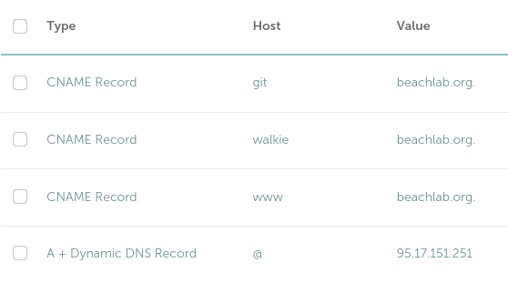
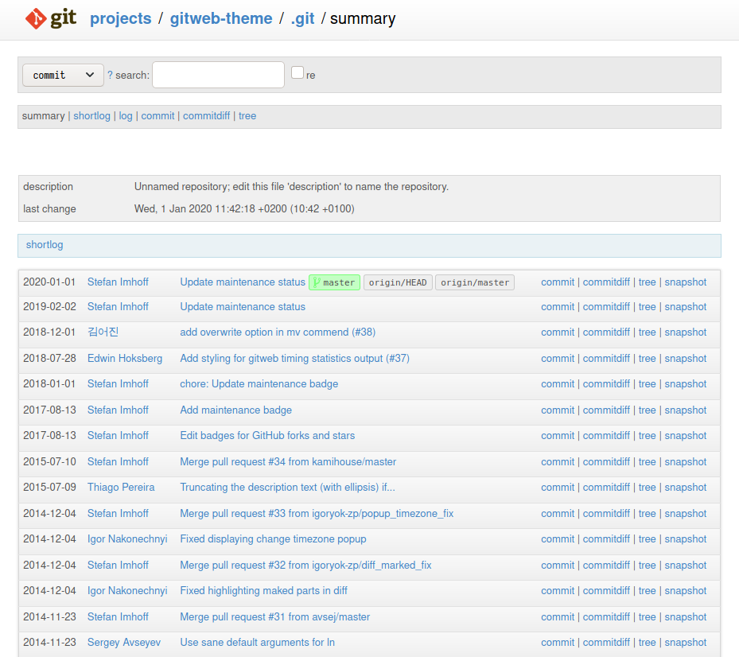

# Selfhosted

> To become independent, you don't have to  ask for independence. To become independent you have *to be* independent.
>
> Fran Sanchez

This is the story of how I am slowly becoming independent.


<!-- vim-markdown-toc GFM -->

* [Why am I doing this](#why-am-i-doing-this)
* [What hardware do you need](#what-hardware-do-you-need)
* [Installing Ubuntu Server](#installing-ubuntu-server)
* [Set the root password](#set-the-root-password)
* [Configure ethernet](#configure-ethernet)
* [Upgrade](#upgrade)
* [Get rid of snap](#get-rid-of-snap)
* [Install sensor monitoring tools and hwinfo](#install-sensor-monitoring-tools-and-hwinfo)
* [Setup a DNS server (WIP)](#setup-a-dns-server-wip)
* [Setup and secure remote ssh access](#setup-and-secure-remote-ssh-access)
	* [Don't use the default port 22](#dont-use-the-default-port-22)
	* [Ban brute force attackers](#ban-brute-force-attackers)
	* [Use 2FA verification codes](#use-2fa-verification-codes)
	* [Use ssh keys instead of password to log in via ssh](#use-ssh-keys-instead-of-password-to-log-in-via-ssh)
* [Set basic firewall rules](#set-basic-firewall-rules)
* [Nginx web server](#nginx-web-server)
	* [Install nginx and create firewall rules](#install-nginx-and-create-firewall-rules)
	* [Create and configure your websites](#create-and-configure-your-websites)
	* [Point your domain to your machine](#point-your-domain-to-your-machine)
	* [Get free trusted SSL certificates for your websites](#get-free-trusted-ssl-certificates-for-your-websites)
	* [The result](#the-result)
* [Backups with rsnapshot](#backups-with-rsnapshot)
	* [Optional. Accessing NFS drives](#optional-accessing-nfs-drives)
	* [Install and setup rsnapshot](#install-and-setup-rsnapshot)
* [Git server](#git-server)
	* [Gitlab? No, thanks](#gitlab-no-thanks)
	* [Setup a plain git server](#setup-a-plain-git-server)
	* [Optional. Disable 2FA for some users](#optional-disable-2fa-for-some-users)
	* [Create or clone a bare repository](#create-or-clone-a-bare-repository)
	* [Working repositories](#working-repositories)
	* [Web Interface](#web-interface)
* [Optional. Nvidia and Cuda](#optional-nvidia-and-cuda)
* [Mumble Server (murmur)](#mumble-server-murmur)
* [IoT](#iot)
	* [Node Red](#node-red)
		* [Prepare](#prepare)
		* [Install](#install)
		* [Usage](#usage)
		* [Secure with https](#secure-with-https)
		* [Secure the editor with username and password](#secure-the-editor-with-username-and-password)
	* [Mosquitto broker](#mosquitto-broker)
		* [Install and test](#install-and-test)
		* [Secure mosquitto](#secure-mosquitto)
		* [Configure MQTT SSL](#configure-mqtt-ssl)
		* [Enable MQTT over websockets](#enable-mqtt-over-websockets)
	* [PostgreSQL](#postgresql)
		* [Install](#install-1)
		* [Create a new role](#create-a-new-role)
		* [Create a new database](#create-a-new-database)
		* [Open a postgres prompt with `iot` role](#open-a-postgres-prompt-with-iot-role)
		* [TimescaleDB](#timescaledb)
		* [Create a hypertable in `iot` database](#create-a-hypertable-in-iot-database)
	* [Managing PostgreSQL with pdAdmin](#managing-postgresql-with-pdadmin)
* [WIP. Mail servers: Postfix, Dovecot and OpenDKIM](#wip-mail-servers-postfix-dovecot-and-opendkim)
	* [Postfix](#postfix)

<!-- vim-markdown-toc -->

## Why am I doing this

My name is Francisco, in french it means "free person" . Some people in life want performance, some other want reliability. The only thing I care about is freedom. To do what I want, when I want and how I want to.

## What hardware do you need

You will be surprised how low-tech this whole thing can go. Of course the better hardware you have the longer you will travel. But for most common needs like website, mail and so, any computer from 10 years ago will be fine. You can even use a raspberry pi and carry your server in your pocket!! My server is a 2015 Skylake i3-6100 (2 cores/4 threads) @ 3.700GHz with 8GB RAM and 500GB SSD running Ubuntu Server 20.04 LTS. It has a UPS power supply. The Internet line is a 600Mbps symmetric FTTH with dynamic IP address.

- TODO: Convert a powerbank to 12V UPS for the router using a [Pololu Adjustable Boost Regulator 4-25V](https://www.pololu.com/product/799/specs)

## Installing Ubuntu Server

First step is installing Ubuntu Server. I installed 20.04 LTS. There are plenty of tutorials on how to do this, so I won't explain it here.

## Set the root password

`sudo passwd root`. **Do not** forget the root password.

## Configure ethernet

Check your ethernet interface name with `ip address` and run `sudo nano /etc/netplan/00-installer-config.yaml`. I have it configured with fixed IP and fixed interface name tied to the mac address.:

```bash
network:
  version: 2
  ethernets:
    lan:
      match:
        macaddress: 00:ab:cd:ef:12:34
      set-name: cable
      dhcp4: no
      addresses:
        - 192.168.1.50/24
      gateway4: 192.168.1.1
      nameservers:
          addresses: [1.0.0.1, 1.1.1.1]
```

Then `sudo netplan apply` you should be connected now.

## Upgrade

```bash
sudo apt update
sudo apt upgrade
```

## Get rid of snap

```bash
sudo snap remove lxd
sudo snap remove core18
sudo snap remove snapd
sudo apt purge snapd
rm -rf ~/snap
```

## Install sensor monitoring tools and hwinfo

```bash
sudo apt install hwinfo
sudo apt install lm-sensors
sudo sensors-detect
sudo apt install hddtemp
sudo apt install glances
```

## Setup a DNS server (WIP)

This was one of the most difficult parts to undertand for me. Actually one of the last parts I did even though you see it at the beginning of this doc. The difficulty was a naming convention. DNS server, like mail server, has multiple meanings. Hence the confusion while reading.


## Setup and secure remote ssh access

### Don't use the default port 22

Replace the standard ssh port `Port 22` with some other in `/etc/ssh/sshd_config`, say 22222. restart ssh `sudo service sshd restart`.

### Ban brute force attackers

Now ban for 10 minutes if someone makes multiple (10) attemps to log in:

```bash
sudo apt install fail2ban
cd /etc/fail2ban
sudo cp fail2ban.conf fail2ban.local
sudo nano fail2ban.local
```

And add the following

```bash
[sshd]
enabled = true
port = 22222
filter = sshd
logpath = /var/log/auth.log
maxretry = 10
bantime = 600
```

And restart fail2ban `sudo service fail2ban restart`

### Use 2FA verification codes

Now configure 2FA. Install `sudo apt install libpam-google-authenticator`, Run `google-authenticator` and scan the qr in your mobile phone app. Edit `sudo nano /etc/pam.d/sshd` and comment out `@include common-auth`. At the bottom of the file add `auth required pam_google_authenticator.so`.

### Use ssh keys instead of password to log in via ssh

We won't  use our password to login via ssh. Instead we will import our public ssh keys from github or gitlab to log in via ssh. In my case I am importing my public keys from github.

`ssh-import-id gh:thebeachlab`

Now edit `sudo nano /etc/ssh/sshd_config` and add/modify:

```bash
ChallengeResponseAuthentication yes
UsePAM yes
AuthenticationMethods publickey,password publickey,keyboard-interactive
PasswordAuthentication no
PermitRootLogin no
```

Restart the service `sudo service sshd restart`

## Set basic firewall rules

```bash
sudo ufw default deny incoming
sudo ufw default allow outgoing
sudo ufw allow 22222/tcp comment 'SSH'
sudo ufw allow http
sudo ufw allow https
sudo ufw enable
sudo ufw reload
```

Optionally drop pings `sudo nano /etc/ufw/before.rules` and add

```bash
-A ufw-before-input -p icmp --icmp-type echo-request -j DROP
```

And again `sudo ufw reload`

## Nginx web server

### Install nginx and create firewall rules

```bash
sudo apt install nginx
sudo ufw allow 'Nginx Full'
```

### Create and configure your websites

Create your website(s) `sudo mkdir -p /var/www/yourdomain.com` and edit `sudo nano /etc/nginx/sites-available/yourdomain.com` with this content

```bash
server {
listen 80;
listen [::]:80;
root /var/www/mydomain.com;
index index.html;
server_name mydomain.com www.mydomain.com;
location / {
try_files $uri $uri/ =404;
}
}
```

Check for mistakes in the syntax `sudo nginx -t`

Create a link to enable the site: `sudo ln -s /etc/nginx/sites-available/mydomain.com /etc/nginx/sites-enabled/mydomain.com` 

Finally reload nginx `sudo systemctl reload nginx`

### Point your domain to your machine

For that you will need to create an A record for `@` (the domain) which points to your public IP and CNAMES for `www` and other hosts pointing to your your domain. If your ISP provides you with a fixed public IP that's all you need to do.

I **don't** have a fixed public IP address though. So instead of an A record  I have [a dynamic A record in namecheap](https://www.namecheap.com/support/knowledgebase/article.aspx/36/11/how-do-i-start-using-dynamic-dns) (where my domains are registered).



Then I use a daemon `ddclient` that uses namecheap API (it can also query several others registrars) to update the IP address in namecheap dynamic A records. Unlike changing an A record, **the dynamic A record propagates instantly**. Install `sudo apt-get install ddclient` and configure ~~`Sudo nano /etc/ddclient/ddclient.conf`~~ `sudo nano /etc/ddclient.conf`

```bash
#### Global Settings
# How often to update (seconds)
daemon=300
ssl=yes
use=web
web=dynamicdns.park-your-domain.com/getip
protocol=namecheap
server=dynamicdns.park-your-domain.com

#### beachlab.org
login=beachlab.org
password='PUT-YOUR-DOMAIN-KEY-HERE'
@.beachlab.org
```

Finally make `ddclient` start when you boot up your ubuntu system

```bash
sudo update-rc.d ddclient defaults
sudo update-rc.d ddclient enable
```

> Is this true?
>
> If the server is in your local network, and you want to reach it by it's hostname, you must point the server local IP address to the server hostname. Get your server machine name `cat /etc/hostname` which in my case returns `thebeachlab` and point it to the **local network** fixed ip address that you set at the beginning `sudo nano /etc/hosts`.
> 
> `192.168.1.50 thebeachlab`
>
> Warning: Still not sure why but 127.0.0.1 will not work. You have to use the network ip.

### Get free trusted SSL certificates for your websites

The following step is to create free trusted SSL certificates. This thing used to cost quite a lot of money but now it's pretty straight forward and there's no reason to have an unencrypted connection anymore. Install certbot:

`sudo apt install certbot python3-certbot-nginx`

Make sure that the auto renewal timer is running `sudo systemctl status certbot.timer` otherwise start and enable it `sudo systemctl enable --now certbot.timer`.

To get certificates for your websites

`sudo certbot --nginx -d mydomain.com -d www.mydomain.com`

To obtain a standalone certificate

`sudo certbot certonly --nginx -d whatever.mydomain.com`

Other tasks you can do:

- View your certificates `sudo certbot certificates`
- Test the auto renewal process `sudo certbot renew --dry-run`
- Delete a certificate `sudo certbot delete`

### The result

My proud website hosted in my suitcase:


## Backups with rsnapshot

> There’s no feeling more intense than starting over. If you've deleted your homework the day before it was due, as I have, or if you left your wallet at home and you have to go back, after spending an hour in the commute, if you won some money at the casino and then put all your winnings on red, but it came up black, if you got your best shirt dry-cleaned before a wedding and then immediately dropped food on it, if you won an argument with a friend and then later discovered that they just returned to their original view, starting over is harder than starting up.
>
> From the videogame "Getting Over It with Bennett Foddyd"

### Optional. Accessing NFS drives

Assuming here you have a NAS or similar with NFS and appropiate user/permissions set. In ubuntu server install the nfs tools:

```bash
sudo apt update
sudo apt install nfs-common
```

Create the local mountpoint `sudo mkdir -p /mnt/backups`

Mount the NFS shared folder `sudo mount 192.168.1.100:/volume1/backups/ubuntu-server /mnt/backups` (your NFS IP and shared volume will differ). Confirm that the drive is mounted `df –h`

```bash
Filesystem                                    Size  Used Avail Use% Mounted on
udev                                          3.8G     0  3.8G   0% /dev
tmpfs                                         786M  1.2M  785M   1% /run
/dev/sda2                                     469G   12G  434G   3% /
tmpfs                                         3.9G     0  3.9G   0% /dev/shm
tmpfs                                         5.0M     0  5.0M   0% /run/lock
tmpfs                                         3.9G     0  3.9G   0% /sys/fs/cgroup
192.168.1.100:/volume1/backups/ubuntu-server  2.7T  1.7T  1.1T  61% /mnt/backups
tmpfs                                         786M     0  786M   0% /run/user/1000
```

Test your write permissions

```bash
cd /mnt/backups
touch test
```

Check on the NFS server that the file is actually there. Now you can automate this to mount at boot time. Add this entry in `/etc/fstab`

`192.168.1.100:/volume1/backups/ubuntu-server /mnt/backups nfs defaults 0 0`

Next time you start your machine the NFS share will be automatically mounted at the specified mount point.

### Install and setup rsnapshot

rsnapshot is a **backup tool based on rsync**. It's fast and can do incremental backups. Install rsnapshot `sudo apt install rsnapshot` and configure it `sudo nano /etc/rsnapshot.conf`. The most important thing to remember is **use tabs instead of spaces to separate keys and values**. Set your intervals and folders to backup. I have created 7 `beta` which I will use for the daily backups and 4 `gamma` that I will use for the weekly backups. At the moment I do not need to create any hourly backup. Also specify what to backup. rsnapshot can backup from anything to anything. In my case I hace rsnapshot locally installed and I am pushing the backups to a NFS. But I could also use a remote server with rsnapshot to pull my files via ssh.

After saving the configuration file check for errors `rsnapshot configtest`. It is advisable also to dry-run test the backup levels/intervals specified in the config file `rsnapshot -t beta`.

Automate your backups in ` crontab -e` **as the root user**

```bash
@daily /usr/bin/rsnapshot beta &> /dev/null
@weekly /usr/bin/rsnapshot gamma &> /dev/null
```

> Make sure that root will have read/write **and admin (change permissions, take ownership)** permissions on the NFS drive. Otherwise you will get errors like:  
> `/bin/cp: failed to preserve ownership for '/mnt/backups/alpha.1/localhost/var': Operation not permitted`

## Git server

### Gitlab? No, thanks

I started installing gitlab but I abandon. It's so, so, so, so bloated with features I don't need. It's a pain in the a$$ to configure with an already existing nginx server. And its a nightmare to later maintain it. So I uninstalled gitlab, reverted all changes and I installed a plain git server. Because in the end. all I want is a place to store my repos. This is not a multiuser environment.

### Setup a plain git server

If you don't have it already `sudo apt install git`

Begin with adding a git user `sudo adduser git` and set up a password for it. Log into the user `su git` and navigate to it's home folder `cd`. Let's now set it up to use ssh keys to log in instead of the password.

```bash
git@thebeachlab:~$ mkdir .ssh
git@thebeachlab:~$ chmod 700 .ssh/
git@thebeachlab:~$ touch .ssh/authorized_keys
git@thebeachlab:~$ chmod 600 .ssh/authorized_keys
```

Now copy one of your public keys in `~/.ssh/authorized_keys`. Alternatively you can import you public keys from github or gitlab

`ssh-import-id gh:thebeachlab`

You should be able now to ssh into git user (or not, read the next section). Meanwhile, we are going to create 2 main folders. One for public repos that we will share on a website and another for private repos.

```bash
git@thebeachlab:~$ mkdir public
git@thebeachlab:~$ mkdir private
```

### Optional. Disable 2FA for some users

If you have configured the ssh server for key and 2FA (with google auth) and you try to ssh into this new git user you will get this error:

```bash
[unix ~]$ ssh -p 22222 git@beachlab.org
git@thebeachlab: Permission denied (keyboard-interactive).
```

This is because after enabling Google authenticator (2 step authentication) you need to enable 2FA for each user. So you have 2 options to run google-authenticator and follow instructions. Pretty secure but you will have to enter the verification code at every push, pull or any other operation. That's quite annoying actually.

Another option is disable 2FA for specific users. In this case I am disabling 2FA for all users in the git group `sudo nano /etc/pam.d/sshd` and add the following just above `auth required pam_google_authenticator.so`:

`auth [success=done default=ignore] pam_succeed_if.so user ingroup git`

And restart sshd `sudo service sshd restart`. You are welcome.

### Create or clone a bare repository

It is important that you understand the difference between a **bare repository** and a **working repository**. If not, read [this](https://www.saintsjd.com/2011/01/what-is-a-bare-git-repository/). **In the ubuntu server all the repositories must be bare**.

To create a bare repository  you have to ssh into git user and:

```bash
git@thebeachlab:~$ cd public
git@thebeachlab:~$ mkdir myrepo.git
git@thebeachlab:~$ cd myrepo.git
git@thebeachlab:~$ git init --bare
```

To clone a bare repository:

`git@thebeachlab:~$ git clone --bare repo-address.git`

> **Beware!** If the repo is private you will need either the login/password (for https address) or a private key (for the ssh address). To send a ssh private key to your server you can use the scp command
>
> scp -P 22222 .ssh/private-key git@git.beachlab.org:/home/git/.ssh/

### Working repositories

Once you have the bare repositories in your server, you can clone a working repository in your computer.

`git clone ssh://git@git.beachlab.org:22222/home/git/public/myrepo.git`

Or if the working repo already exist in your computer. you can add a new remote pointing to your suitcase.

`git remote add suitcase ssh://git@git.beachlab.org:22222/home/git/public/myrepo.git`

### Web Interface



If you want to go to something like <https://git.beachlab.org> and have a simple web frontend of your repos keep reading. There are [a number of options](https://git.wiki.kernel.org/index.php/Interfaces,_frontends,_and_tools#Web_Interfaces), I use [gitweb](https://git.wiki.kernel.org/index.php/Gitweb) `sudo apt install gitweb fcgiwrap`. The main config file is `/etc/gitweb.conf`. Make sure you only list public repos:

`$projectroot = "/home/git/public/";`

Create a new site in `/etc/nginx/sites-available/git.beachlab.org`:

```bash
server {
        listen 80;
        listen [::]:80;
        root /usr/share/gitweb;
        index index.cgi;
        server_name git.beachlab.org;
        location / {
                try_files $uri $uri/ /index.cgi =404;
        }
        location /index.cgi {
                root /usr/share/gitweb/;
                include fastcgi_params;
                gzip off;
                fastcgi_param SCRIPT_NAME $uri;
                fastcgi_param GITWEB_CONFIG /etc/gitweb.conf;
                fastcgi_pass unix:/var/run/fcgiwrap.socket;
        }
}
```
Check for mistakes in the syntax `sudo nginx -t -c /etc/nginx/nginx.conf` and create a link to enable the site: `sudo ln -s /etc/nginx/sites-available/git.beachlab.org /etc/nginx/sites-enabled/git.beachlab.org`. Reload nginx `sudo systemctl reload nginx`.

Add ssl certificates `sudo certbot --nginx -d git.beachlab.org`

Now test the site by accessing the URL over browser (after adding CNAME record and entries in `/etc/hosts`).

There are many other things you can customize in `etc/gitweb.conf` and the files in `/usr/share/gitweb`. Check it out. I use this theme <http://kogakure.github.io/gitweb-theme/>

## Optional. Nvidia and Cuda

This is just in case you need gpu accelerated encoders or decoders for video server. [Remove the nouveau kernel](https://tutorials.technology/tutorials/85-How-to-remove-Nouveau-kernel-driver-Nvidia-install-error.html) then download and install cuda and the driver from nvidia page. Check version `nvcc --version`.

## Mumble Server (murmur)

Mumble is a low latency voice chat service. Before you start, decide the host (walkie.beachlab.org) and the port (50000) and modify your `/etc/hosts/`, add an CNAME record, set up NAT port forwarding and create a firewall rule.

```bash
sudo ufw allow 50000
sudo ufw reload
sudo ufw status
```

Install the required packages and perform initial configuration

```bash
sudo add-apt-repository ppa:mumble/release
sudo apt update
sudo apt install mumble-server
sudo apt install sqlite
sudo dpkg-reconfigure mumble-server
```

Dig in more advanced config `sudo nano /etc/mumble-server.ini`. Change the port, the host and other parameters

```
; Port to bind TCP and UDP sockets to.
port=50000

; Specific IP or hostname to bind to.
; If this is left blank (default), Murmur will bind to all available addresses.
host=walkie.beachlab.org

; Password to join server.
serverpassword=supersecret

; Maximum number of concurrent clients allowed.
users=20

; Maximum depth of channel nesting. Note that some databases like MySQL using
; InnoDB will fail when operating on deeply nested channels.
channelnestinglimit=4

; Maximum number of channels per server. 0 for unlimited. Note that an
; excessive number of channels will impact server performance
channelcountlimit=100

; Maximum length of text messages in characters. 0 for no limit.
textmessagelength=500

; If you only wish to give your "Root" channel a custom name, then only
; uncomment the 'registerName' parameter.
;
registerName=Beach Lab Fun
```

Reload the server if you make changes `sudo service mumble-server restart`

## IoT

### Node Red

#### Prepare

Create a CNAME for this host like `node` and forward port 1880 to the server in the NAT. Edit the `/etc/hosts` accordingly. Also create a firewall rule.

#### Install

```bash
sudo apt install build-essential git
bash <(curl -sL https://raw.githubusercontent.com/node-red/linux-installers/master/deb/update-nodejs-and-nodered)
```

#### Usage

Autostart on boot `sudo systemctl enable nodered.service`

Manual commands:

```bash
node-red-start
node-red-stop
node-red-restart
node-red-log
```

#### Secure with https

`sudo certbot certonly --nginx -d node.beachlab.org`

Note where the certificates are located `/etc/letsencrypt/live/node.beachlab.org/`. Certificates will renew automatically, but we need to create a hook to reload node-red, when certificate is renewed..

`sudo nano /etc/letsencrypt/renewal/node.beachlab.org.conf`

add

`renew_hook = systemctl restart nodered`

test

`sudo certbot renew --dry-run`

Now, this is a bit strange. To enable https you have to modify the `settings.js` file. This file lives in the home folder of the user who installed node red (???). There is no system wide settings. Either I am missing something or tnis is silly. In any case to make https work I had to do this:

```bash
sudo cp /etc/letsencrypt/live/node.beachlab.org/privkey.pem .
sudo chown pink:pink privkey.pe
sudo cp /etc/letsencrypt/live/node.beachlab.org/cert.pem .
sudo chown pink:pink cert.pem
nano settings.js
```

and uncomment/edit the following lines

```js
https: {
    key: require("fs").readFileSync('/home/pink/.node-red/privkey.pem'),
    cert: require("fs").readFileSync('/home/pink/.node-red/cert.pem')
},

requireHttps: true,
```


> Note: http to https redirection is not working but I don't know why. [Here they propose](https://stackoverflow.com/questions/53808673/node-red-requirehttps-does-not-work-accessing-http-does-not-redirect-to-https) a workaround.
>
> I ended up redirecting http://node.beachlab.org to https://node.beachlab.org:1880 in by creating and enabling a site in nginx
>
> ```bash
> server {
>	listen 80;
>	listen [::]:80;
>	server_name node.beachlab.org;
>	return 301 https://$host:1880$request_uri;
> }
> ```


#### Secure the editor with username and password

If you use node red without user authentication anyone can take over the whole system.

`nano .node-red/settings.js`

and uncomment/edit

```js
    // Securing Node-RED
    // -----------------
    // To password protect the Node-RED editor and admin API, the following
    // property can be used. See http://nodered.org/docs/security.html for details.
    adminAuth: {
        type: "credentials",
        users: [{
            username: "admin",
            password: "$2a$08$zZWtXTja0fB1pzD4sHCMyOCMYz2Z6dNbM6tl8sJogENOMcxWV9DN.",
            permissions: "*"
        }]
    },
```

> Note: The above are not my real username/password. Do you think I am idiot?

To generate the password hash use `node-red admin hash-pw`

### Mosquitto broker

In this IoT world, who doesn't need a mosquitto broker? Create a CNAME for the host `mosquitto` in your domain registrar. In your router, forward NAT port 1883 to your server. Create a firewall rule to allow 1883/tcp.

#### Install and test

`sudo apt install mosquitto mosquitto-clients`

In another computer try to subscribe to your mosquitto broker

`mosquitto_sub -h mosquitto.beachlab.org -t test`

In the server publish something to the broker

`mosquitto_pub -h localhost -t test -m "hello world"`

This was my first MQTT message!

#### Secure mosquitto

Generate a password for a specific user, in this case me, and store it in /etc/mosquitto/passwd

`sudo mosquitto_passwd -c /etc/mosquitto/passwd fran`

Create a config file to deny anonymous users

`sudo nano /etc/mosquitto/conf.d/default.conf`

And paste

```bash
allow_anonymous false
password_file /etc/mosquitto/passwd

```

Make sure there is a new line at the end of the file. Restart mosquitto `sudo systemctl restart mosquitto`. Now try to subscribe again to test

```bash
[unix ~]$ mosquitto_sub -h mosquitto.beachlab.org -t test
Connection error: Connection Refused: not authorised.
```

Try to send a message to this topic

```bash
pink@thebeachlab:~$ mosquitto_pub -h localhost -t test -m "hello world"
Connection error: Connection Refused: not authorised.
```

We are good. Subscribe with username and password

`mosquitto_sub -h mosquitto.beachlab.org -t test -u "fran" -P "password"`

Should be good now. And try to publish

`mosquitto_pub -h localhost -t test -u "fran" -P "password" -m "hello world"`

The message should have been received! The only problem remains is that I am sending tthe password unencrypted over the internet. Oh boy....

#### Configure MQTT SSL

Let's generate the certificates

`sudo certbot certonly --nginx -d mosquitto.beachlab.org`

Open the config file and specify the location of the certificates and the port to use `sudo nano /etc/mosquitto/conf.d/default.conf` and add

```bash
listener 1883 localhost

listener 8883
certfile /etc/letsencrypt/live/mosquitto.beachlab.org/cert.pem
cafile /etc/letsencrypt/live/mosquitto.beachlab.org/chain.pem
keyfile /etc/letsencrypt/live/mosquitto.beachlab.org/privkey.pem
```

1883 will now be unencrypted just for the localhost. Remember to update the firewall rules and the NAT. Reload mosquitto

`sudo systemctl restart mosquitto`

Now subscribe from localhost:

`mosquitto_sub -h localhost -t test -u "fran" -P "password"`

Publish from outside

```bash
[unix ~]$ mosquitto_pub -h mosquitto.beachlab.org -p 8883 --capath /etc/ssl/certs/ -t test -m "hello ssl" -u "fran" -P "password"
Error: Connection refused
[unix ~]$ mosquitto_pub -h mosquitto.beachlab.org -p 8883 --capath /etc/ssl/certs/ -t test -m "hello ssl" -u "fran" -P "password"
```

The message should have arrived. To subscribe from outside

`mosquitto_sub -h mosquitto.beachlab.org -p 8883 --capath /etc/ssl/certs/ -t test -u "fran" -P "password"`

#### Enable MQTT over websockets

`sudo nano /etc/mosquitto/conf.d/default.conf`

Add

```bash
listener 8083
protocol websockets
certfile /etc/letsencrypt/live/mosquitto.beachlab.org/cert.pem
cafile /etc/letsencrypt/live/mosquitto.beachlab.org/chain.pem
keyfile /etc/letsencrypt/live/mosquitto.beachlab.org/privkey.pem

```

Add firewall rules. Adjust NAT or just like me setup a DMZ host for the damn server. I have tested it with the mobile app [owntracks](https://owntracks.org/) and it works like a charm. Coming up in IoT, storing your precious data in a database.

### PostgreSQL

#### Install

```bash
sudo apt update
sudo apt install postgresql postgresql-contrib
```

Check

```bash
pink@thebeachlab:~$ sudo -u postgres psql
psql (12.4 (Ubuntu 12.4-0ubuntu0.20.04.1))
Type "help" for help.

postgres=# 
```

Exit with `\q`

#### Create a new role

```bash
pink@thebeachlab:~$ sudo -u postgres createuser --interactive
Enter name of role to add: iot
Shall the new role be a superuser? (y/n) y
```

#### Create a new database

A postgres assumption is that a role will have a database with the same name which it can access. That means `iot` role will attempt to connect to `iot` database by default. So let's create `iot` database.

`sudo -u postgres createdb iot`

#### Open a postgres prompt with `iot` role

Due to the ident based authentication, you need a Linux user with the same name as your postgres role and database.

`sudo adduser iot`

Now you can connect to the `iot` database with

`sudo -u iot psql`

Check your connection with `\connifo`

```bash
iot=# \conninfo
You are connected to database "iot" as user "iot" via socket in "/var/run/postgresql" at port "5432"
```

Exit with `\q`. A role can also connect to a different database

```bash
pink@thebeachlab:~$ sudo -u iot psql -d postgres
psql (12.4 (Ubuntu 12.4-0ubuntu0.20.04.1))
Type "help" for help.

postgres=# \conninfo
You are connected to database "postgres" as user "iot" via socket in "/var/run/postgresql" at port "5432".
```

#### TimescaleDB

IoT stores huge time series data. Relational databases can be used to store the data but processing can be slow. TimescaleDB is an NoSQL database optimized to store time-series data. It is implemented as an extension of PostgreSQL combining the ease of use of relational databases and the speed of NoSQL databases.

Install

```bash
sudo add-apt-repository ppa:timescale/timescaledb-ppa
sudo apt update
sudo apt install timescaledb-postgresql-12
```

Configure and optimize

```bash
pink@thebeachlab:~$ sudo timescaledb-tune
Using postgresql.conf at this path:
/etc/postgresql/12/main/postgresql.conf

Is this correct? [(y)es/(n)o]: y
Writing backup to:
/tmp/timescaledb_tune.backup202010261003

shared_preload_libraries needs to be updated
Current:
#shared_preload_libraries = ''
Recommended:
shared_preload_libraries = 'timescaledb'
Is this okay? [(y)es/(n)o]: y
success: shared_preload_libraries will be updated

Tune memory/parallelism/WAL and other settings? [(y)es/(n)o]: y
Recommendations based on 7.74 GB of available memory and 4 CPUs for PostgreSQL 12

Memory settings recommendations
Current:
shared_buffers = 128MB
#effective_cache_size = 4GB
#maintenance_work_mem = 64MB
#work_mem = 4MB
Recommended:
shared_buffers = 1981MB
effective_cache_size = 5944MB
maintenance_work_mem = 1014453kB
work_mem = 5072kB
Is this okay? [(y)es/(s)kip/(q)uit]: y
success: memory settings will be updated

Parallelism settings recommendations
Current:
missing: timescaledb.max_background_workers
#max_worker_processes = 8
#max_parallel_workers_per_gather = 2
#max_parallel_workers = 8
Recommended:
timescaledb.max_background_workers = 8
max_worker_processes = 15
max_parallel_workers_per_gather = 2
max_parallel_workers = 4
Is this okay? [(y)es/(s)kip/(q)uit]: y
success: parallelism settings will be updated

WAL settings recommendations
Current:
#wal_buffers = -1
min_wal_size = 80MB
Recommended:
wal_buffers = 16MB
min_wal_size = 512MB
Is this okay? [(y)es/(s)kip/(q)uit]: y
success: WAL settings will be updated

Miscellaneous settings recommendations
Current:
#default_statistics_target = 100
#random_page_cost = 4.0
#checkpoint_completion_target = 0.5
#max_locks_per_transaction = 64
#autovacuum_max_workers = 3
#autovacuum_naptime = 1min
#effective_io_concurrency = 1
Recommended:
default_statistics_target = 500
random_page_cost = 1.1
checkpoint_completion_target = 0.9
max_locks_per_transaction = 64
autovacuum_max_workers = 10
autovacuum_naptime = 10
effective_io_concurrency = 200
Is this okay? [(y)es/(s)kip/(q)uit]: y
success: miscellaneous settings will be updated
Saving changes to: /etc/postgresql/12/main/postgresql.conf
```

If you are going to say yes to all you could also do `sudo timescaledb-tune --quiet --yes`. Now restart postpres

`sudo systemctl restart postgresql.service`

#### Create a hypertable in `iot` database

First connect to `iot`

`sudo -u iot psql`

Enable the TimescaleDB extension

```bash
iot=# CREATE EXTENSION IF NOT EXISTS timescaledb CASCADE;
WARNING:  
WELCOME TO
 _____ _                               _     ____________  
|_   _(_)                             | |    |  _  \ ___ \ 
  | |  _ _ __ ___   ___  ___  ___ __ _| | ___| | | | |_/ / 
  | | | |  _ ` _ \ / _ \/ __|/ __/ _` | |/ _ \ | | | ___ \ 
  | | | | | | | | |  __/\__ \ (_| (_| | |  __/ |/ /| |_/ /
  |_| |_|_| |_| |_|\___||___/\___\__,_|_|\___|___/ \____/
               Running version 1.7.4
For more information on TimescaleDB, please visit the following links:

 1. Getting started: https://docs.timescale.com/getting-started
 2. API reference documentation: https://docs.timescale.com/api
 3. How TimescaleDB is designed: https://docs.timescale.com/introduction/architecture

Note: TimescaleDB collects anonymous reports to better understand and assist our users.
For more information and how to disable, please see our docs https://docs.timescaledb.com/using-timescaledb/telemetry.

CREATE EXTENSION
```

Disable telemetry (sending data to Timescale) and restart postgres

```bash
pink@thebeachlab:~$ sudo -u postgres psql
psql (12.4 (Ubuntu 12.4-0ubuntu0.20.04.1))
Type "help" for help.

postgres=# ALTER SYSTEM SET timescaledb.telemetry_level=off
postgres-# \q
pink@thebeachlab:~$ sudo systemctl restart postgresql.service
```

> To be continued...

### Managing PostgreSQL with pdAdmin

```bash
curl https://www.pgadmin.org/static/packages_pgadmin_org.pub | sudo apt-key add
sudo sh -c 'echo "deb https://ftp.postgresql.org/pub/pgadmin/pgadmin4/apt/$(lsb_release -cs) pgadmin4 main" > /etc/apt/sources.list.d/pgadmin4.list && apt update'
sudo apt install pgadmin4-web
sudo /usr/pgadmin4/bin/setup-web.sh
```

> Note: It gave error regarding missing Apache. Need to finish the [hosting section with nginx](https://www.pgadmin.org/docs/pgadmin4/latest/server_deployment.html#hosting) but I don't fully understand it yet.
>
> I also have to install pgAgent

## WIP. Mail servers: Postfix, Dovecot and OpenDKIM

### Postfix

Postfix is a MTA mail transfer agent, it receives the emails from the Internet and stores them until you retrieve them.

```bash
sudo apt update
sudo DEBIAN_PRIORITY=low apt install postfix
```

Whenever you need to reconfigure postfix `sudo dpkg-reconfigure postfix`
