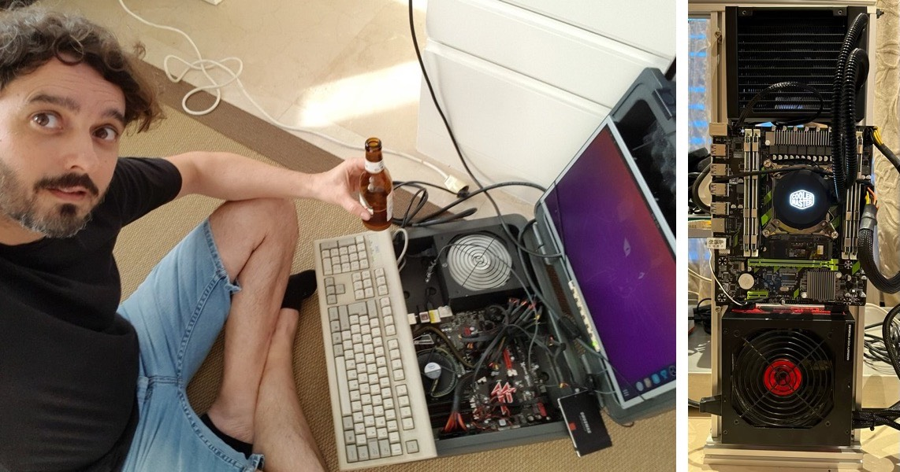

# Selfhosted

> To become independent, you don't have to  ask for independence. To become independent you have **to be** independent.

This is the story of how I am slowly becoming independent. Disclaimer: If you don't understand anything, that's fine. I created this documentation for myself.

## Why am I doing this

My name is Francisco, in french it means "free person" . Some people in life want performance, some other want reliability. The only thing I care about is freedom. To do what I want, when I want and how I want to.

## What hardware do you need

You will be surprised how low-tech this whole thing can go. Of course the better hardware you have the longer you will travel. But for most common needs like website, mail and so, any computer from 10 years ago will be fine. You can even use a raspberry pi and carry your server in your pocket!! 

My first server, called Suitcase is a 2015 Skylake i3-6100 (2 cores/4 threads) @ 3.700GHz with 8GB RAM and 500GB SSD running Ubuntu Server 22.04 LTS. 

My second server, called Sister is a X79 chipset with a liquid cooled Intel Xeon E5-2670 v2 (10 cores/20 threads) @2.500Ghz with 40GB RAM and 1TB NVME SSD running Ubuntu Server 22.04 LTS.

The server has a UPS power supply. The Internet line is a 600Mbps symmetric FTTH with dynamic IP address.

- TODO: Convert a powerbank to 12V UPS for the router using a [Pololu Adjustable Boost Regulator 4-25V](https://www.pololu.com/product/799/specs)

## TOC

- [Getting started](doc/getstarted.md)
- [Securing SSH access](doc/security.md)
- [Backups](doc/backups.md)
- [Web server](doc/web.md)
- [NodeJS Server](doc/nodejs.md)
- [Git server](doc/git.md)
- [SFTP server](doc/sftp.md)
- [Mumble server](doc/mumble.md)
- [VPN Server](doc/vpn.md)
- [IoT related](doc/iot.md)
- [Postgresql Database Server](doc/postgres.md)
  - [Strapi CSM](doc/strapi.md)
  - [PostgREST API](doc/postgrest.md)
  - [OSM Server](doc/osm.md)
  - [Working with CSV](doc/csv.md)
- [GPU related](doc/gpu.md)
- [OpenHab Server](doc/openhab.md)
- [Troubleshooting](doc/troubleshooting.md)

To improve or fix
- [Understanding DNS](doc/dns.md)
- [Taskserver](doc/taskserver.md)
- [OBS ninja](doc/obsninja.md)
- [STUN/TURN Server (WIP)](doc/turn.md)
- [Minecraft server](doc/minecraft.md)
- [Cloud server](doc/cloud.md)
- [Mail server](doc/mail.md)

