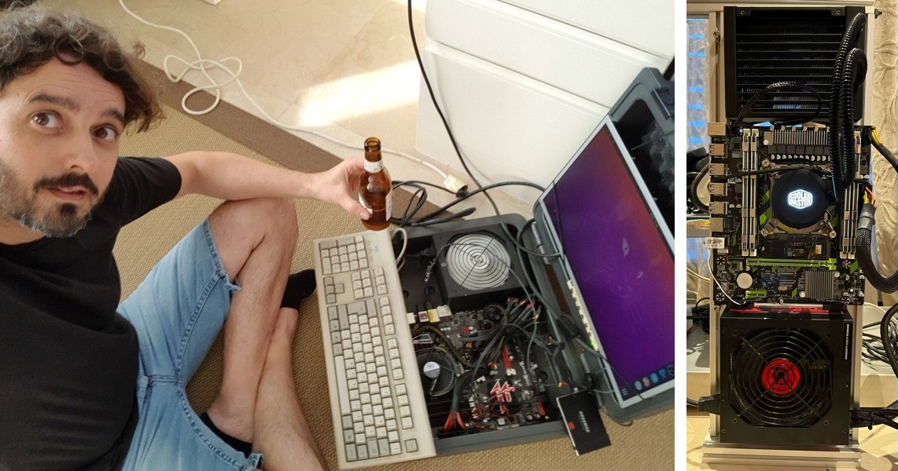

# Selfhosted

> To become independent, you don't have to  ask for independence. To become independent you have **to be** independent.

This is the story of how I am slowly becoming independent. Disclaimer: If you don't understand anything, that's fine. I created this documentation for myself.

## Why am I doing this

My name is Francisco, in french it means "free person" . Some people in life want performance, some other want reliability. The only thing I care about is freedom. To do what I want, when I want and how I want to.

## Current infrastructure

**Server:** Intel NUC 11, 16 GB RAM, 1 TB NVMe. Ubuntu Server. Connected via 1 Gbps symmetric FTTH (dynamic IP). eGPU (Razer Core X + RTX 2070 Super) currently offline — PSU dead since 2026-03-04.

**RPi 5 (pibot1):** Mounted in the G Mobile Lab (vehicle). Runs Bluetti BLE bridge, I2C sensors (CO2, temp, humidity, pressure), GPS NEO-6M, IMU MPU-6050, and Starlink gRPC telemetry. Connects to server via Starlink + Tailscale.

**Previous servers (non-operational):**
- *Suitcase* — 2015 Skylake i3-6100, 8 GB RAM, 500 GB SSD
- *Sister* — X79 Xeon E5-2670 v2 (10c/20t), 40 GB RAM, 1 TB NVMe

## TOC

### Server setup
- [Getting started](doc/getstarted.md)
- [Securing SSH access](doc/security.md)
- [Backups](doc/backups.md)
- [Web server (Nginx)](doc/web.md)
- [Git server](doc/git.md)
- [SFTP server](doc/sftp.md)
- [VPN Server (OpenVPN)](doc/vpn.md)
- [WireGuard VPN](doc/wireguard.md)
- [Server Safeguards (resource limits + alerts)](doc/server-safeguards.md)
- [Troubleshooting](doc/troubleshooting.md)

### Services
- [Transmission Daemon (NordVPN)](doc/transmission.md)
- [Mumble voice server](doc/mumble.md)
- [iOS Push Notifications (iGotify)](doc/igotify.md)
- [n8n automation](doc/n8n.md)
- [Auto USB copy](doc/transfer2usb.md)
- [Node.js / PM2](doc/nodejs.md)
- [OpenClaw TUI Quick Access (tmux)](doc/openclaw-tui.md)

### IoT and telemetry
- [IoT (Mosquitto MQTT)](doc/iot.md)
- [MQTT Telemetry — server stats (alpha/stats)](doc/mqtt-telemetry.md)
- [MQTT to TimescaleDB and PostgREST](doc/mqtt-timescale-postgrest.md)
- [Bluetti Mobile Lab telemetry pipeline](doc/bluetti-telemetry.md)
- [Raspberry Pi 5 (pibot1)](doc/rpi.md)

### Databases and APIs
- [PostgreSQL](doc/postgres.md)
  - [TimescaleDB](doc/timescaledb.md)
  - [Strapi CMS](doc/strapi.md)
  - [PostgREST API](doc/postgrest.md)
  - [PostgREST JWT Gateway](doc/postgrest-jwt.md)

### AI and GPU
- [GPU setup](doc/gpu.md)
- [GPU Service Management (on-demand Whisper/RAG/TTS)](doc/gpu-services.md)
- [Whisper Web (protected upload + diarization)](doc/whisper.md)
- [High-Precision eBook RAG (SFTP Inbox)](doc/rag-library.md)
- [Qwen3-TTS Voice Cloning (multilingual)](doc/qwen3-tts.md)
- [ComfyUI (Stable Diffusion node editor)](doc/comfyui.md)
- [Hailo AI dataflow compiler](doc/ai.md)

### WIP / archived
- [Understanding DNS](doc/dns.md) `[WIP]`
- [Taskwarrior server](doc/taskserver.md)
- [OBS ninja (WebRTC)](doc/obsninja.md) `[WIP]`
- [STUN/TURN Server](doc/turn.md) `[WIP]`
- [Minecraft server](doc/minecraft.md) `[ARCHIVED]`
- [Nextcloud](doc/cloud.md) `[ARCHIVED]`
- [Mail server (Postfix)](doc/mail.md) `[INCOMPLETE]`
- [OpenHab](doc/openhab.md) `[ARCHIVED]`
