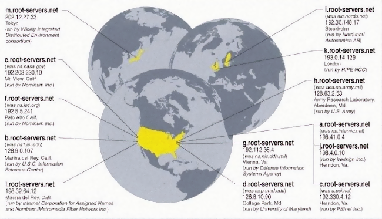

# Setup an DNS server (WIP)

This was one of the most difficult parts to undertand for me. Actually one of the last parts I did even though you see it at the beginning of this doc. The difficulty was a naming convention. DNS server, like mail server, has multiple meanings. Hence the confusion while reading. BTW, a DNS is a yellow pages book of The Internet.

<!-- vim-markdown-toc GFM -->

* [A little bit of history](#a-little-bit-of-history)
* [Queries](#queries)
* [Split Horizon name server](#split-horizon-name-server)
* [Installing your own recursive  DNS server. Unbound](#installing-your-own-recursive--dns-server-unbound)

<!-- vim-markdown-toc -->

## A little bit of history

> If you skip this section you might not undersand the mess of DNS servers.

Initially (in the 1970s) there was a single file HOSTS.TXT that could be downloaded by FTP from a computer at Stanford. This contained a name-to-address mapping of all the (few hundred) hosts on the then [ARPAnet](https://en.wikipedia.org/wiki/ARPANET). The Linux `/etc/hosts` is the residual decedent of the original HOSTS.TXT.

> If you are passionate of the early days of Internet do read <http://www.byte.org/one-history-of-dns.pdf>

The use of an FTP copy of HOSTS.TXT quickly became difficult to maintain, with the growth of the number of hosts, by the time an update had been copied to the far reaches, it was out of date! In 1984 Paul Mockapetris (University of Southern California) created DNS, a hyerarchical distributed database of servers called *name servers*. Your computer has a client called **stub-resolver** that query a **recursive server** (you can choose where to query, and it is stored in /etc/resolv.conf).

The recursive server might or might not have the answer of the query you made. If it has the answer in RAM memory it will return it to you. Otherwise, the recursive server will query the **root name servers**.

At the top of the hyerarchy of the DNS system there are the **root name servers**. Each keep details about some segment of the Internet. There are 13 root name servers (designated A-M). The root nameservers are overseen by a nonprofit called the Internet Corporation for Assigned Names and Numbers (ICANN).

> In reality there are more instances of these 13 nameservers seamlessly spread across the world with [anycast](https://en.wikipedia.org/wiki/Anycast) addressing.



Looking at this map you will realise that the location of these servers are 10% technical and 90% political. The purpose of the root name servers is to answer requests for records in the root zone and to answer other requests by returning a list of the **TLD name servers** for the appropriate top-level domain (TLD).


A TLD nameserver maintains information for all the domain names that share a common domain extension, such as `.com`, `.net`, or whatever comes after the last dot in a url. For example, a `.com` TLD nameserver contains information for every website that ends in `.com`. Management of TLD nameservers is handled by the Internet Assigned Numbers Authority (IANA), which is a branch of ICANN.

When the recursive resolver receives a response from a root nameserver, it would send a query to the appropiate TLD nameserver, which would lookup at the **glue records** (NS records) and respond by pointing to the **authoritative nameserver** (ns1.yourdomain.com, ns2.yourdomain.com). The authoritative nameserver contains information specific to the domain name it serves (e.g. yourdomain.com) and it can provide a recursive resolver with the IP address of that server found in the DNS A record, or if the domain has a CNAME record (alias).

When you buy a domain you can set glue records of the authoritative nameserver or use the ones they provide. To host an authoritative nameserver must have a fixed IP address, as this address needs to be known by the TLD nameserver.

To finalise the process, the recursive resolver returns the IP address to the stub resolver and stores it in RAM for the specified TTL in the A record.

You can always host your own recursive server and if you have a fixed IP you could also host an authoritative server for your domains. 

## Queries

```bash
[unix ~]$ host node.beachlab.org
node.beachlab.org is an alias for beachlab.org.
beachlab.org has address 95.17.151.229
beachlab.org mail is handled by 20 mx2.spamfiltering.com.
beachlab.org mail is handled by 10 mx1.spamfiltering.com.
```

`host` command queries A, AAAA, CNAME and MX records

You can narrow down the query by specifying `host -t a node.beachlab.org`

You can also query the reverse zone 

```bash
[unix ~]$ host 95.17.151.229
229.151.17.95.in-addr.arpa domain name pointer 229.151.17.95.dynamic.jazztel.es.
```

In this case it is not coincident with the domain because my ISP jazztel did not associate a PTR record. Because of that I cannot host a mail server.

I can also query the SOA 

```bash
[unix ~]$ host -t soa beachlab.org
beachlab.org has SOA record dns1.registrar-servers.com. hostmaster.registrar-servers.com. 1604104104 43200 3600 604800 3601
```

Which gives me information about my authoritative server.


## Split Horizon name server

To be continued...

## Installing your own recursive  DNS server. Unbound


`sudo apt install bind9 bind9utils`

`sudo nano /etc/default/bind9`
