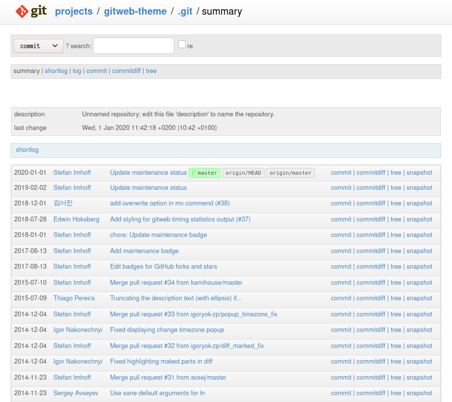

# Git server

<!-- vim-markdown-toc GFM -->

* [Gitlab? No, thanks](#gitlab-no-thanks)
* [Setup a plain git server](#setup-a-plain-git-server)
* [Optional. Disable 2FA for some users](#optional-disable-2fa-for-some-users)
* [Create or clone a bare repository](#create-or-clone-a-bare-repository)
* [Working repositories](#working-repositories)
* [Web Interface](#web-interface)
* [Deploy your website with git](#deploy-your-website-with-git)

<!-- vim-markdown-toc -->

## Gitlab? No, thanks

I started installing gitlab but I abandon. It's so, so, so, so bloated with features I don't need. It's a pain in the a$$ to configure with an already existing nginx server. And its a nightmare to later maintain it. So I uninstalled gitlab, reverted all changes and I installed a plain git server. Because in the end. all I want is a place to store my repos. This is not a multiuser environment.

## Setup a plain git server

If you don't have it already `sudo apt install git`

Begin with adding a git user `sudo adduser git` and set up a password for it. Log into the user `su git` and navigate to it's home folder `cd`. Let's now set it up to use ssh keys to log in instead of the password.

```bash
git@thebeachlab:~$ mkdir .ssh
git@thebeachlab:~$ chmod 700 .ssh/
git@thebeachlab:~$ touch .ssh/authorized_keys
git@thebeachlab:~$ chmod 600 .ssh/authorized_keys
```

Now copy one of your public keys in `~/.ssh/authorized_keys`. Alternatively you can import you public keys from github or gitlab

`ssh-import-id gh:thebeachlab`

You should be able now to ssh into git user (or not, read the next section). Meanwhile, we are going to create 2 main folders. One for public repos that we will share on a website and another for private repos.

```bash
git@thebeachlab:~$ mkdir public
git@thebeachlab:~$ mkdir private
```

## Optional. Disable 2FA for some users

If you have configured the ssh server for key and 2FA (with google auth) and you try to ssh into this new git user you will get this error:

```bash
[unix ~]$ ssh -p 22222 git@beachlab.org
git@thebeachlab: Permission denied (keyboard-interactive).
```

This is because after enabling Google authenticator (2 step authentication) you need to enable 2FA for each user. So you have 2 options to run google-authenticator and follow instructions. Pretty secure but you will have to enter the verification code at every push, pull or any other operation. That's quite annoying actually.

Another option is disable 2FA for specific users. In this case I am disabling 2FA for all users in the git group `sudo nano /etc/pam.d/sshd` and add the following just above `auth required pam_google_authenticator.so`:

`auth [success=done default=ignore] pam_succeed_if.so user ingroup git`

And restart sshd `sudo service sshd restart`. You are welcome.

## Create or clone a bare repository

It is important that you understand the difference between a **bare repository** and a **working repository**. If not, read [this](https://www.saintsjd.com/2011/01/what-is-a-bare-git-repository/). **In the ubuntu server all the repositories must be bare**.

To create a bare repository  you have to ssh into git user and:

```bash
git@thebeachlab:~$ cd public
git@thebeachlab:~$ mkdir myrepo.git
git@thebeachlab:~$ cd myrepo.git
git@thebeachlab:~$ git init --bare
```

To clone a bare repository:

`git@thebeachlab:~$ git clone --bare repo-address.git`

> **Beware!** If the repo is private you will need either the login/password (for https address) or a private key (for the ssh address). To send a ssh private key to your server you can use the scp command
>
> scp -P 22222 .ssh/private-key git@beachlab.org:/home/git/.ssh/

## Working repositories

Once you have the bare repositories in your server, you can clone a working repository in your computer.

`git clone ssh://git@beachlab.org:22222/home/git/public/myrepo.git`

Or if the working repo already exist in your computer. you can add a new remote pointing to your suitcase.

`git remote add suitcase ssh://git@git.beachlab.org:22222/home/git/public/myrepo.git`

## Web Interface



If you want to go to something like <https://git.beachlab.org> and have a simple web frontend of your repos keep reading. There are [a number of options](https://git.wiki.kernel.org/index.php/Interfaces,_frontends,_and_tools#Web_Interfaces), I use [gitweb](https://git.wiki.kernel.org/index.php/Gitweb) `sudo apt install gitweb fcgiwrap`. The main config file is `/etc/gitweb.conf`. Make sure you only list public repos:

`$projectroot = "/home/git/public/";`

Create a new site in `/etc/nginx/sites-available/git.beachlab.org`:

```bash
server {
        listen 80;
        listen [::]:80;
        root /usr/share/gitweb;
        index index.cgi;
        server_name git.beachlab.org;
        location / {
                try_files $uri $uri/ /index.cgi =404;
        }
        location /index.cgi {
                root /usr/share/gitweb/;
                include fastcgi_params;
                gzip off;
                fastcgi_param SCRIPT_NAME $uri;
                fastcgi_param GITWEB_CONFIG /etc/gitweb.conf;
                fastcgi_pass unix:/var/run/fcgiwrap.socket;
        }
}
```
Check for mistakes in the syntax `sudo nginx -t -c /etc/nginx/nginx.conf` and create a link to enable the site: `sudo ln -s /etc/nginx/sites-available/git.beachlab.org /etc/nginx/sites-enabled/git.beachlab.org`. Reload nginx `sudo systemctl reload nginx`.

Add ssl certificates `sudo certbot --nginx -d git.beachlab.org`

Now test the site by accessing the URL over browser (after adding CNAME record and entries in `/etc/hosts`).

There are many other things you can customize in `etc/gitweb.conf` and the files in `/usr/share/gitweb`. Check it out. I use this theme <http://kogakure.github.io/gitweb-theme/>

## Deploy your website with git

You can deploy and update your website to your nginx server using a bare repository and git hooks. Here's how I do it.

- Init or clone a bare repository in your public folder. In my case, I cloned the one I already have from github `git clone --bare git@github.com:TheBeachLab/BeachLab_website.git`. I later renamed `BeachLab_website.git` to `blweb.git` as my life is shortening and every character I save counts.
- Enter the hooks folder `cd blweb.git/hooks`
- Create a new hook `touch post-receive`
- **WARNING: This option is probably not a good idea for you**. Make `/var/www` writable by everyone. `sudo chmod 777 /var/www`. I am assuming here you already have a website up and running and configured as `/var/www/beachlab.org`, if not check the [web](web.md) section.
- Create the following hook `nano post-receive`. This will copy the current version of the repository files to the folder where the website is being served everytime you push to it.

```bash
 #!/bin/sh

# The production directory
TARGET="/var/www/beachlab.org"

# A temporary directory for deployment
TEMP="/home/git/tmp/beachlab.org"

# The Git repo
REPO="/home/git/public/blweb.git"

# Deploy the content to the temporary directory
mkdir -p $TEMP
git --work-tree=$TEMP --git-dir=$REPO checkout -f

# Do stuffs, like npm install…

# Replace the production directory
# with the temporary directory

rm -rf $TARGET
mv $TEMP $TARGET
```

In your local machine you will have a working copy of your repository that you can push to your suitcase and/or to github. Actually you can push to both at the same time or separately depending upon how you configure your remotes and the default upstream

```bash
[unix ~/Repositories/Beach Lab/website]$ git remote -v
github	git@github.com:TheBeachLab/BeachLab_website.git (fetch)
github	git@github.com:TheBeachLab/BeachLab_website.git (push)
origin	git@github.com:TheBeachLab/BeachLab_website.git (fetch)
origin	git@github.com:TheBeachLab/BeachLab_website.git (push)
origin	ssh://git@beachlab.org:22222/home/git/public/blweb.git (push)
suitcase	ssh://git@beachlab.org:22222/home/git/public/blweb.git (fetch)
suitcase	ssh://git@beachlab.org:22222/home/git/public/blweb.git (push)
```

In this case I can push to github `git push github master` or to the suitcase `git push suitcase master` or to both `git push origin master`. You can also set what is the default upstream when you just do a `git push` by doing `git push --set-upstream origin master`.

> TODO: Rename all my `master` branches to `main` in all repositories. And set default to `main`


