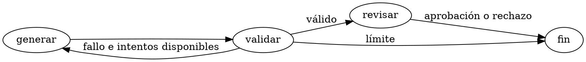

# Graph tools: generate, inspect and correct

**Author:** Fran
**Checked:** 2026-10-02

Para explorar el grafo sin una interfaz externa, usar JupyterLab, NetworkX,
PyVis y Graphviz. Los paquetes de Hailo que ya existen en el NUC son parte de
otro entorno; crear el laboratorio de [LangGraph](langgraph.md) y añadir:

```bash
cd ~/knowledge-graphs/langgraph-lab
uv add 'networkx==3.7' 'pyvis==0.3.2' 'jupyterlab==4.6.4'
```

Versiones consultadas el 2026-10-02 en
[NetworkX](https://pypi.org/project/networkx/3.7/),
[PyVis](https://pypi.org/project/pyvis/0.3.2/) y
[JupyterLab](https://pypi.org/project/jupyterlab/4.6.4/).
NetworkX 3.7 requiere Python 3.12+; no instalarlo sobre los entornos Python 3.10
de los servicios existentes.

## Exportar el grafo del ejemplo

Guardar como `inspect_graph.py`, junto al `loop.py` de la guía LangGraph:

```python
from pathlib import Path
import re

import networkx as nx
from pyvis.network import Network

from loop import graph

workflow = graph.get_graph()
g = nx.DiGraph()
g.add_nodes_from(workflow.nodes)
g.add_edges_from((edge.source, edge.target) for edge in workflow.edges)

print("Ciclos cortos:", list(nx.simple_cycles(g, length_bound=6)))
print("Aislados:", list(nx.isolates(g)))
print("Sin salida:", [n for n in g if n != "__end__" and g.out_degree(n) == 0])
print("Inalcanzables:", sorted(set(g) - nx.descendants(g, "__start__") - {"__start__"}))

Path("loop.mmd").write_text(workflow.draw_mermaid(), encoding="utf-8")
view = Network(height="750px", width="100%", directed=True, cdn_resources="in_line")
view.from_nx(g)
html = view.generate_html(notebook=False)
# Esta vista no usa controles Bootstrap. PyVis 0.3.2 los carga desde un CDN.
html = re.sub(r'<link\b[^>]*href="https?://[^"]+"[^>]*>', "", html)
html = re.sub(r'<script\b[^>]*src="https?://[^"]+"[^>]*>\s*</script>', "", html)
Path("loop.html").write_text(html, encoding="utf-8")
```

```bash
uv run python inspect_graph.py
```

`loop.html` permite explorar los nodos y `loop.mmd` guarda el Mermaid generado
desde la estructura real del ejemplo. El ciclo `generar → validar → generar`
es intencionado. NetworkX analiza la estructura; no demuestra que una condición
de salida funcione ni que se respete el límite de intentos. Eso se comprueba
ejecutando el loop. `length_bound=6` limita la búsqueda a ciclos cortos.
[simple_cycles](https://networkx.org/documentation/stable/reference/algorithms/generated/networkx.algorithms.cycles.simple_cycles.html),
[PyVis](https://pyvis.readthedocs.io/en/latest/documentation.html).

La plantilla de PyVis 0.3.2 añade Bootstrap remoto incluso con recursos inline.
El ejemplo elimina esas dos referencias, que esta vista sin filtros no necesita.
Revisar los recursos de cualquier otra plantilla antes de considerarla offline.

Mover nodos en la visualización no modifica el código ni la base. Corregir
`loop.py`, volver a ejecutar y regenerar el HTML. Para datos Neo4j, consultar un
subgrafo acotado, guardar IDs y procedencia, y pasar por el flujo de corrección
de [Neo4j](neo4j.md) o [Graphiti](graphiti.md).

## Dibujar con Graphviz

El NUC ya tiene `dot`. Guardar como `loop.dot` este diagrama manual:



```bash
dot -Tsvg loop.dot -o loop.svg
```

El SVG es útil para documentación y revisiones; actualizar el `.dot` cuando
cambie el flujo. [Opciones de Graphviz](https://graphviz.org/doc/info/command.html).

## JupyterLab por túnel

Desde el laboratorio del NUC, con su autenticación de token activa:

```bash
uv run jupyter lab --ip=127.0.0.1 --port=18888 --no-browser
```

Desde el Mac:

```bash
ssh -N -o ExitOnForwardFailure=yes \
  -L 127.0.0.1:18888:127.0.0.1:18888 pink-sudo
```

Abrir la URL con token que entrega Jupyter, sin guardarlo en Git ni compartirlo.
El puerto 18888 se reserva aquí para Jupyter **o** el Obsidian remoto propuesto;
usar otro si ambos están activos. Un notebook ejecuta código con los permisos
de su usuario. Mantener el listener en loopback.
[Acceso al servidor Jupyter](https://jupyter-server.readthedocs.io/en/latest/operators/public-server.html).

Estas instrucciones preparan un laboratorio; la interfaz Jupyter del NUC y la
persistencia de sus notebooks quedan pendientes de probar tras instalarlo.

## Verificación de esta guía

El 2026-10-02, el exportador del ejemplo se ejecutó en el laboratorio temporal
del Mac: encontró el ciclo esperado, sin nodos aislados, inalcanzables ni salidas
muertas distintas de `END`. Se abrió el HTML en el navegador de Codex y se
comprobó que dibujaba los cinco nodos y las transiciones; no registró errores o
avisos de consola. Se comprobó que el HTML no tenía recursos externos activos
en etiquetas `script`/`link`. El `dot` ya instalado en el NUC generó un SVG válido,
guardado en el directorio temporal del Mac. No se arrancó Jupyter en el NUC.
