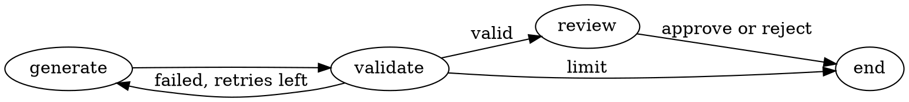

# Graph tools

**Author:** Fran

<!-- vim-markdown-toc GFM -->

- [Install](#install)
- [Find cycles and draw the graph](#find-cycles-and-draw-the-graph)
- [Graphviz](#graphviz)
- [JupyterLab](#jupyterlab)

<!-- vim-markdown-toc -->

I want to see the graph without depending on an external interface.
NetworkX can inspect its structure, PyVis makes an interactive HTML page and
Graphviz produces an SVG.

## Install

Use the Python 3.12 [LangGraph lab](langgraph.md):

```bash
cd ~/knowledge-graphs/langgraph-lab
uv add 'networkx==3.7' 'pyvis==0.3.2' 'jupyterlab==4.6.4'
```

The NUC has graph packages inside the Hailo and other environments. Leave those
with their applications; these versions go in the lab.

## Find cycles and draw the graph

Save this as `inspect_graph.py` next to `loop.py`:

```python
from pathlib import Path
import re

import networkx as nx
from pyvis.network import Network

from loop import graph

workflow = graph.get_graph()
g = nx.DiGraph()
g.add_nodes_from(workflow.nodes)
g.add_edges_from((edge.source, edge.target) for edge in workflow.edges)

print("Short cycles:", list(nx.simple_cycles(g, length_bound=6)))
print("Isolated nodes:", list(nx.isolates(g)))
print("Dead ends:", [n for n in g if n != "__end__" and g.out_degree(n) == 0])
print("Unreachable:", sorted(set(g) - nx.descendants(g, "__start__") - {"__start__"}))

Path("loop.mmd").write_text(workflow.draw_mermaid(), encoding="utf-8")
view = Network(height="750px", width="100%", directed=True, cdn_resources="in_line")
view.from_nx(g)
html = view.generate_html(notebook=False)
# PyVis adds remote Bootstrap files that this view does not need.
html = re.sub(r'<link\b[^>]*href="https?://[^"]+"[^>]*>', "", html)
html = re.sub(r'<script\b[^>]*src="https?://[^"]+"[^>]*>\s*</script>', "", html)
Path("loop.html").write_text(html, encoding="utf-8")
```

Run it:

```bash
uv run python inspect_graph.py
```

Open `loop.html` in the browser. The Mermaid version is in `loop.mmd`.

The `generate -> validate -> generate` cycle is expected. The loop is
supposed to retry. [NetworkX](https://networkx.org/documentation/stable/reference/algorithms/generated/networkx.algorithms.cycles.simple_cycles.html)
finds the cycle; running the loop tells me whether it stops.

Moving nodes around only changes the drawing. To fix the loop, edit
`loop.py`, run it again and regenerate the HTML. For stored facts, use the
[Graphiti correction](graphiti.md#fix-a-fact).

## Graphviz

The NUC already has `dot`. Save this as `loop.dot`:



Generate the image:

```bash
dot -Tsvg loop.dot -o loop.svg
```

This one is a hand-written diagram. Update it when the code changes.
[Graphviz](https://graphviz.org/doc/info/command.html) supports other output
formats too.

## JupyterLab

Start it in the NUC lab:

```bash
uv run jupyter lab --ip=127.0.0.1 --port=18888 --no-browser
```

From the Mac:

```bash
ssh -N -o ExitOnForwardFailure=yes \
  -L 127.0.0.1:18888:127.0.0.1:18888 pink-sudo
```

Open the URL with the token that Jupyter prints. Keep its
[authentication](https://jupyter-server.readthedocs.io/en/latest/operators/public-server.html)
enabled and the listener on localhost. A notebook can run commands as its user.
