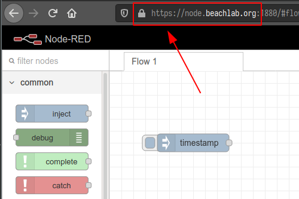

# IoT

<!-- vim-markdown-toc GFM -->

* [Node Red](#node-red)
	* [Prepare](#prepare)
	* [Install](#install)
	* [Usage](#usage)
	* [Secure with https](#secure-with-https)
	* [Secure the editor with username and password](#secure-the-editor-with-username-and-password)
* [Mosquitto broker](#mosquitto-broker)
	* [Install and test](#install-and-test)
	* [Secure mosquitto](#secure-mosquitto)
	* [Configure MQTT SSL](#configure-mqtt-ssl)
	* [Enable MQTT over websockets](#enable-mqtt-over-websockets)
* [PostgreSQL](#postgresql)
	* [Install](#install-1)
	* [Remote connection](#remote-connection)
	* [Common psql commands](#common-psql-commands)
	* [Create a new role](#create-a-new-role)
	* [Create a new database](#create-a-new-database)
	* [Open a postgres prompt with `iot` role](#open-a-postgres-prompt-with-iot-role)
	* [TimescaleDB](#timescaledb)
	* [Create a hypertable in `iot` database](#create-a-hypertable-in-iot-database)
* [Managing PostgreSQL with pgAdmin](#managing-postgresql-with-pgadmin)
	* [Install pgadmin4](#install-pgadmin4)
	* [Apache and nginx together](#apache-and-nginx-together)
	* [Creating a subdomain (optional)](#creating-a-subdomain-optional)
	* [Securing pgadmin with https (optional)](#securing-pgadmin-with-https-optional)
	* [Configure pgadmin](#configure-pgadmin)
	* [Running pgadmin](#running-pgadmin)
	* [Tips and tricks](#tips-and-tricks)
		* [For every table](#for-every-table)
		* [Autoupdate the modified timestamp when a record is updated](#autoupdate-the-modified-timestamp-when-a-record-is-updated)
		* [New template from table](#new-template-from-table)

<!-- vim-markdown-toc -->

## Node Red

> I installed node red as a root service

### Prepare

Create a CNAME for this host like `node` and forward port 1880 to the server in the NAT. Edit the `/etc/hosts` accordingly. Also create a firewall rule.

### Install

```bash
su
apt install build-essential git
bash <(curl -sL https://raw.githubusercontent.com/node-red/linux-installers/master/deb/update-nodejs-and-nodered)
npm install -g node-red-admin
```

### Usage

Autostart on boot `systemctl enable nodered.service`

Manual commands:

```bash
node-red-start
node-red-stop
node-red-restart
node-red-admin
node-red-log
```

### Secure with https

`certbot certonly --nginx -d node.beachlab.org`

Note where the certificates are located `/etc/letsencrypt/live/node.beachlab.org/`. Certificates will renew automatically, but we need to create a hook to reload node-red, when certificate is renewed..

`nano /etc/letsencrypt/renewal/node.beachlab.org.conf`

add

`renew_hook = systemctl restart nodered`

test

`certbot renew --dry-run`

and uncomment/edit the following lines

```js
https: {
    key: require("fs").readFileSync('/etc/letsencrypt/live/node.beachlab.org/privkey.pem'),
    cert: require("fs").readFileSync('/etc/letsencrypt/live/node.beachlab.org/cert.pem')
},

requireHttps: true,
```



> Note: http to https redirection is not working but I don't know why. [Here they propose](https://stackoverflow.com/questions/53808673/node-red-requirehttps-does-not-work-accessing-http-does-not-redirect-to-https) a workaround.
>
> I ended up redirecting http://node.beachlab.org to https://node.beachlab.org:1880 in by creating and enabling a site in nginx
>
> ```bash
> server {
>	listen 80;
>	listen [::]:80;
>	server_name node.beachlab.org;
>	return 301 https://$host:1880$request_uri;
> }
> ```

### Secure the editor with username and password

If you use node red without user authentication anyone can take over the whole system.

`nano .node-red/settings.js`

and uncomment/edit

```js
    // Securing Node-RED
    // -----------------
    // To password protect the Node-RED editor and admin API, the following
    // property can be used. See http://nodered.org/docs/security.html for details.
    adminAuth: {
        type: "credentials",
        users: [{
            username: "admin",
            password: "$2a$08$zZWtXTja0fB1pzD4sHCMyOCMYz2Z6dNbM6tl8sJogENOMcxWV9DN.",
            permissions: "*"
        }]
    },
```

> Note: The above are not my real username/password. Do you think I am idiot?

To generate the password hash use `node-red-admin hash-pw`

## Mosquitto broker

In this IoT world, who doesn't need a mosquitto broker? Create a CNAME for the host `mosquitto` in your domain registrar. In your router, forward NAT port 1883 to your server. Create a firewall rule to allow 1883/tcp.

### Install and test

`sudo apt install mosquitto mosquitto-clients`

In another computer try to subscribe to your mosquitto broker

`mosquitto_sub -h mosquitto.beachlab.org -t test`

In the server publish something to the broker

`mosquitto_pub -h localhost -t test -m "hello world"`

This was my first MQTT message!

### Secure mosquitto

Generate a password for a specific user, in this case me, and store it in /etc/mosquitto/passwd

`sudo mosquitto_passwd -c /etc/mosquitto/passwd fran`

Create a config file to deny anonymous users

`sudo nano /etc/mosquitto/conf.d/default.conf`

And paste

```bash
allow_anonymous false
password_file /etc/mosquitto/passwd

```

Make sure there is a new line at the end of the file. Restart mosquitto `sudo systemctl restart mosquitto`. Now try to subscribe again to test

```bash
[unix ~]$ mosquitto_sub -h mosquitto.beachlab.org -t test
Connection error: Connection Refused: not authorised.
```

Try to send a message to this topic

```bash
pink@thebeachlab:~$ mosquitto_pub -h localhost -t test -m "hello world"
Connection error: Connection Refused: not authorised.
```

We are good. Subscribe with username and password

`mosquitto_sub -h mosquitto.beachlab.org -t test -u "fran" -P "password"`

Should be good now. And try to publish

`mosquitto_pub -h localhost -t test -u "fran" -P "password" -m "hello world"`

The message should have been received! The only problem remains is that I am sending tthe password unencrypted over the internet. Oh boy....

### Configure MQTT SSL

Let's generate the certificates

`sudo certbot certonly --nginx -d mosquitto.beachlab.org`

Open the config file and specify the location of the certificates and the port to use `sudo nano /etc/mosquitto/conf.d/default.conf` and add

```bash
listener 1883 localhost

listener 8883
certfile /etc/letsencrypt/live/mosquitto.beachlab.org/cert.pem
cafile /etc/letsencrypt/live/mosquitto.beachlab.org/chain.pem
keyfile /etc/letsencrypt/live/mosquitto.beachlab.org/privkey.pem
```

1883 will now be unencrypted just for the localhost. Remember to update the firewall rules and the NAT. Reload mosquitto

`sudo systemctl restart mosquitto`

Now subscribe from localhost:

`mosquitto_sub -h localhost -t test -u "fran" -P "password"`

Publish from outside

```bash
[unix ~]$ mosquitto_pub -h mosquitto.beachlab.org -p 8883 --capath /etc/ssl/certs/ -t test -m "hello ssl" -u "fran" -P "password"
Error: Connection refused
[unix ~]$ mosquitto_pub -h mosquitto.beachlab.org -p 8883 --capath /etc/ssl/certs/ -t test -m "hello ssl" -u "fran" -P "password"
```

The message should have arrived. To subscribe from outside

`mosquitto_sub -h mosquitto.beachlab.org -p 8883 --capath /etc/ssl/certs/ -t test -u "fran" -P "password"`

### Enable MQTT over websockets

`sudo nano /etc/mosquitto/conf.d/default.conf`

Add

```bash
listener 8083
protocol websockets
certfile /etc/letsencrypt/live/mosquitto.beachlab.org/cert.pem
cafile /etc/letsencrypt/live/mosquitto.beachlab.org/chain.pem
keyfile /etc/letsencrypt/live/mosquitto.beachlab.org/privkey.pem

```

Add firewall rules. Adjust NAT or just like me setup a DMZ host for the damn server. I have tested it with the mobile app [owntracks](https://owntracks.org/) and it works like a charm. Coming up in IoT, storing your precious data in a database.

## PostgreSQL

### Install

```bash
sudo apt update
sudo apt install postgresql postgresql-contrib
```

Check

```bash
pink@thebeachlab:~$ sudo -u postgres psql
psql (12.4 (Ubuntu 12.4-0ubuntu0.20.04.1))
Type "help" for help.

postgres=#
```

Exit with `\q`

### Remote connection

- Add a firewall rule `sudo ufw allow 5432 comment 'postgres'`and `sudo ufw reload`
- Listen connections in `/etc/postgresql/12/main/postgresql.conf`
- Accept connections on `/etc/postgresql/12/main/pg_hba.conf` from local network `192.168.1.0/24`
- On remote (arch) install `postgresql-libs` package
- Test `psql -h 192.168.1.50 -U postgres`

### Common psql commands

- List databases `\l`
- List databases with size, tablespace and description `\l+`
- Connect to database `\c database`
- Display tables `\dt` and `\dt+`
- Display users `\du`

### Create a new role

```bash
pink@thebeachlab:~$ sudo -u postgres createuser --interactive
Enter name of role to add: iot
Shall the new role be a superuser? (y/n) y
```

### Create a new database

A postgres assumption is that a role will have a database with the same name which it can access. That means `iot` role will attempt to connect to `iot` database by default. So let's create `iot` database.

`sudo -u postgres createdb iot`

### Open a postgres prompt with `iot` role

Due to the ident based authentication, you need a Linux user with the same name as your postgres role and database.

`sudo adduser iot`

Now you can connect to the `iot` database with

`sudo -u iot psql`

Check your connection with `\connifo`

```bash
iot=# \conninfo
You are connected to database "iot" as user "iot" via socket in "/var/run/postgresql" at port "5432"
```

Exit with `\q`. A role can also connect to a different database

```bash
pink@thebeachlab:~$ sudo -u iot psql -d postgres
psql (12.4 (Ubuntu 12.4-0ubuntu0.20.04.1))
Type "help" for help.

postgres=# \conninfo
You are connected to database "postgres" as user "iot" via socket in "/var/run/postgresql" at port "5432".
```

### TimescaleDB

IoT stores huge time series data. Relational databases can be used to store the data but processing can be slow. TimescaleDB is an NoSQL database optimized to store time-series data. It is implemented as an extension of PostgreSQL combining the ease of use of relational databases and the speed of NoSQL databases.

Install

```bash
sudo add-apt-repository ppa:timescale/timescaledb-ppa
sudo apt update
sudo apt install timescaledb-postgresql-12
```

Configure and optimize

```bash
pink@thebeachlab:~$ sudo timescaledb-tune
Using postgresql.conf at this path:
/etc/postgresql/12/main/postgresql.conf

Is this correct? [(y)es/(n)o]: y
Writing backup to:
/tmp/timescaledb_tune.backup202010261003

shared_preload_libraries needs to be updated
Current:
#shared_preload_libraries = ''
Recommended:
shared_preload_libraries = 'timescaledb'
Is this okay? [(y)es/(n)o]: y
success: shared_preload_libraries will be updated

Tune memory/parallelism/WAL and other settings? [(y)es/(n)o]: y
Recommendations based on 7.74 GB of available memory and 4 CPUs for PostgreSQL 12

Memory settings recommendations
Current:
shared_buffers = 128MB
#effective_cache_size = 4GB
#maintenance_work_mem = 64MB
#work_mem = 4MB
Recommended:
shared_buffers = 1981MB
effective_cache_size = 5944MB
maintenance_work_mem = 1014453kB
work_mem = 5072kB
Is this okay? [(y)es/(s)kip/(q)uit]: y
success: memory settings will be updated

Parallelism settings recommendations
Current:
missing: timescaledb.max_background_workers
#max_worker_processes = 8
#max_parallel_workers_per_gather = 2
#max_parallel_workers = 8
Recommended:
timescaledb.max_background_workers = 8
max_worker_processes = 15
max_parallel_workers_per_gather = 2
max_parallel_workers = 4
Is this okay? [(y)es/(s)kip/(q)uit]: y
success: parallelism settings will be updated

WAL settings recommendations
Current:
#wal_buffers = -1
min_wal_size = 80MB
Recommended:
wal_buffers = 16MB
min_wal_size = 512MB
Is this okay? [(y)es/(s)kip/(q)uit]: y
success: WAL settings will be updated

Miscellaneous settings recommendations
Current:
#default_statistics_target = 100
#random_page_cost = 4.0
#checkpoint_completion_target = 0.5
#max_locks_per_transaction = 64
#autovacuum_max_workers = 3
#autovacuum_naptime = 1min
#effective_io_concurrency = 1
Recommended:
default_statistics_target = 500
random_page_cost = 1.1
checkpoint_completion_target = 0.9
max_locks_per_transaction = 64
autovacuum_max_workers = 10
autovacuum_naptime = 10
effective_io_concurrency = 200
Is this okay? [(y)es/(s)kip/(q)uit]: y
success: miscellaneous settings will be updated
Saving changes to: /etc/postgresql/12/main/postgresql.conf
```

If you are going to say yes to all you could also do `sudo timescaledb-tune --quiet --yes`. Now restart postpres

`sudo systemctl restart postgresql.service`

### Create a hypertable in `iot` database

First connect to `iot`

`sudo -u iot psql`

Enable the TimescaleDB extension

```bash
iot=# CREATE EXTENSION IF NOT EXISTS timescaledb CASCADE;
WARNING:
WELCOME TO
 _____ _                               _     ____________
|_   _(_)                             | |    |  _  \ ___ \
  | |  _ _ __ ___   ___  ___  ___ __ _| | ___| | | | |_/ /
  | | | |  _ ` _ \ / _ \/ __|/ __/ _` | |/ _ \ | | | ___ \
  | | | | | | | | |  __/\__ \ (_| (_| | |  __/ |/ /| |_/ /
  |_| |_|_| |_| |_|\___||___/\___\__,_|_|\___|___/ \____/
               Running version 1.7.4
For more information on TimescaleDB, please visit the following links:

 1. Getting started: https://docs.timescale.com/getting-started
 2. API reference documentation: https://docs.timescale.com/api
 3. How TimescaleDB is designed: https://docs.timescale.com/introduction/architecture

Note: TimescaleDB collects anonymous reports to better understand and assist our users.
For more information and how to disable, please see our docs https://docs.timescaledb.com/using-timescaledb/telemetry.

CREATE EXTENSION
```

Disable telemetry (sending data to Timescale) and restart postgres

```bash
pink@thebeachlab:~$ sudo -u postgres psql
psql (12.4 (Ubuntu 12.4-0ubuntu0.20.04.1))
Type "help" for help.

postgres=# ALTER SYSTEM SET timescaledb.telemetry_level=off
postgres-# \q
pink@thebeachlab:~$ sudo systemctl restart postgresql.service
```

> To be continued...

## Managing PostgreSQL with pgAdmin

### Install pgadmin4

```bash
#
# Setup the repository
#

# Install the public key for the repository (if not done previously):
sudo curl https://www.pgadmin.org/static/packages_pgadmin_org.pub | sudo apt-key add

# Create the repository configuration file:
sudo sh -c 'echo "deb https://ftp.postgresql.org/pub/pgadmin/pgadmin4/apt/$(lsb_release -cs) pgadmin4 main" > /etc/apt/sources.list.d/pgadmin4.list && apt update'

#
# Install pgAdmin
#
# Install for web mode only:
sudo apt install pgadmin4-web
```

### Apache and nginx together

To avoid both web servers listening to the same port change the default listening port from 80 to 5050 and 443 to 8090 in `/etc/apache2/ports.conf`

```bash
Listen 5050

<IfModule ssl_module>
        Listen 8090
</IfModule>

<IfModule mod_gnutls.c>
        Listen 8090
</IfModule>
```

and `sudo nano /etc/apache2/sites-available/000-default.conf` and set

```
<VirtualHost *:5050>
```

Then reload the service `sudo systemctl restart apache2` and verify Apache is listening to 8080 `sudo netstat -tlpn`

Also create the ufw rules `sudo ufw allow 5050 comment 'apache pgadmin'` and `sudo ufw reload`

pgadmin will be located at `http://server-address:5050/pgadmin4`

### Creating a subdomain (optional)

I created and enabled `/etc/nginx/sites-available/postgres.beachlab.org` with this content

```bash
server {
        listen 80;
        listen [::]:80;
        server_name postgres.beachlab.org;
        return 301 http://beachlab.org:5050/pgadmin4;
}
```

If you don't require https that's all.

### Securing pgadmin with https (optional)

NOT WORKING YET. Check modules /etc/apache2/ports.conf and files in /etc/apache2/sites-enabled then change redisect in /etc/nginx/sites-available/postgres.beachlab.org (and remove ufw apache full rules?)

`sudo certbot certonly --standalone -d postgres.beachlab.org` which creates certificates in `/etc/letsencrypt/live/postgres.beachlab.org/`. Certificates will renew automatically.

Set

```bash
ServerName beachlab.org
ServerAlias postgres.beachlab.org
```

in `/etc/apache2/sites-available/000-default.conf`. Check syntax `sudo apache2ctl configtest` and `sudo systemctl reload apache2`

Install certbot apache plugin `sudo apt install certbot python3-certbot-apache` and run `sudo certbot --apache` but not redirect`


### Configure pgadmin

Run `/usr/pgadmin4/bin/setup-web.sh`

### Running pgadmin

Go to `http://server-ip:5050/pgadmin4`

if you don't remember the credentials `mv /var/lib/pgadmin/pgadmin4.db /var/lib/pgadmin/pgadmin4.db.backup` and run `/usr/pgadmin4/bin/setup-web.sh` again.

Add a server and enter the connection details. You might have to connect to `sudo -u postgres psql` and `ALTER USER postgres PASSWORD 'mynewpassword';` if you don't remember your credentials.

ERD files are stored in `/var/lib/pgadmin/storage/email_account.org/erdfiles/`

### Tips and tricks

#### For every table

- create a column named `id` with `bigint` or `int` datatype and IDENTITY. This will be the primary key. Enroll tables, also known as join tables will have more records than other records.
- create a column named `created` of `timestamp with timezone` datatype and default value `now()`
- create a column named `modified` of `timestamp with timezone` datatype and default value `now()`

Probably best to set all these in a table template.

#### Autoupdate the modified timestamp when a record is updated

Using pgadmin query tool create a function `update_timestamp_modified_column()`

```sql
CREATE OR REPLACE FUNCTION update_timestamp_modified_column()
RETURNS TRIGGER AS $$
BEGIN
  CASE WHEN OLD.* IS DISTINCT FROM NEW.* THEN
    NEW.modified = NOW();
    RETURN NEW;
  ELSE
    RETURN OLD;
  END CASE;
END;
$$ LANGUAGE 'plpgsql';
```

This function will appear under `trigger functions`. Now, for every table, we create a trigger for each table

```sql
CREATE TRIGGER update_modified
BEFORE UPDATE ON users
FOR EACH ROW
EXECUTE PROCEDURE update_timestamp_modified_column();
```

#### New table from existing table

```sql
CREATE TABLE template (LIKE users INCLUDING ALL);
```

Does not copy triggers. You will have to do this manually

#### Add new column to existing table

Here adding a foreign key

```sql
ALTER TABLE interests ADD COLUMN IF NOT EXISTS interest_group_id INTEGER NOT NULL;
```

#### Add one to many

Altered table has the many, select the foreign key. The reference table and (id) has the one

```sql
ALTER TABLE public.interests
    ADD FOREIGN KEY (interest_group_id)
    REFERENCES public.interest_group (id)
    NOT VALID;
```


