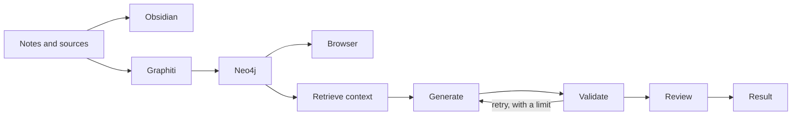

# Knowledge graphs and agent loops

<!-- vim-markdown-toc GFM -->

- [What I want](#what-i-want)
- [The pieces](#the-pieces)
- [Where to start](#where-to-start)
- [Visual editors](#visual-editors)
- [Separate projects](#separate-projects)

<!-- vim-markdown-toc -->

## What I want

I want to write notes, connect ideas, run an agent loop and see where it gets
stuck. Then fix it and continue. I also want the memory to keep the original
source and remember when things changed.

This setup is still WIP. Graphviz and Node-RED are already on the NUC. Obsidian
is installed on the Mac; I couldn't find it in the NUC services or application
folders. LangGraph, Graphiti and Neo4j still need their own setup there.

## The pieces

- [Obsidian](obsidian.md) for notes, links and Canvas.
- [LangGraph](langgraph.md) to run the loop, inspect its state and pause for a decision.
- [Graphiti](graphiti.md) to turn sources into memory with dates and references.
- [Neo4j](neo4j.md) to store that memory. Browser comes with it and lets me query the graph.
- [Graphviz, NetworkX, PyVis and JupyterLab](graph-tools.md) to draw graphs and find cycles.

Obsidian links are links between notes. LangGraph edges decide what runs next.
Neo4j relationships connect stored data. Drawing an arrow in Canvas does not
connect these applications; that part needs code.

## Where to start

Connect to the NUC with `ssh pink-sudo`. Create the [LangGraph lab](langgraph.md)
first. The example runs without a model, so I can try the loop, its limit and
the pause without paying for API calls.

Next, start [Neo4j](neo4j.md) and open Browser through SSH. Add Graphiti after
choosing its model and a small set of sources. Keep the Python environments
separate from Hailo, ComfyUI, RAG and the other services.

There is already a pilot in `/Users/Papi/Repositories/project-knowledge/`
for Strategy and Hariburi. It has its own Neo4j instances, Obsidian vaults and
model clients. Its configuration uses the Mac's Colima profile, so copying it
to the NUC needs some adaptation.

## Visual editors

Node-RED is already running on port 1880. It is useful for wiring services,
MQTT and APIs. Its setup is in [IoT](iot.md).

[Studio](https://docs.langchain.com/langsmith/studio) shows LangGraph runs and
their state. It loads its interface from LangSmith. For a local view,
[PyVis and JupyterLab](graph-tools.md) are enough to explore the example.

[Langflow](https://docs.langflow.org/) is another option for building AI flows
with the mouse. It runs its own flows; it does not edit arbitrary LangGraph
code. [Arrows](https://neo4j.com/labs/arrows/) is useful for sketching a Neo4j
model and exporting Cypher.

## Separate projects

Keep each project's database and credentials separate. Graphiti's
`group_id` filters results, but it is not an access control boundary.

Put code and original notes in Git. Keep databases, checkpoints, credentials
and ingestion receipts in a private data directory, with a backup. Generated
notes and diagrams come from their sources: fix the source and regenerate.
