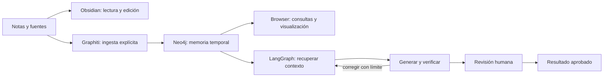

# Knowledge graphs and agent loops

**Author:** Fran
**Checked:** 2026-10-02

Quiero poder crear un flujo, ver qué está haciendo, parar cuando haga falta y
corregirlo. También quiero guardar conocimiento con su fuente y su fecha. Estas
herramientas cubren partes distintas del trabajo:

| Trabajo | Herramienta | Qué se modifica |
| --- | --- | --- |
| Escribir y relacionar notas | [Obsidian](obsidian.md): enlaces, Graph view y Canvas | Markdown y archivos `.canvas` |
| Ejecutar un loop de agentes | [LangGraph](langgraph.md) | Código Python, estado y checkpoints |
| Extraer y recuperar memoria temporal | [Graphiti](graphiti.md) | Episodios y relaciones derivadas de sus fuentes |
| Guardar y consultar nodos y relaciones | [Neo4j Community + Browser](neo4j.md) | Datos mediante Cypher |
| Dibujar la estructura de un flujo | Mermaid / Graphviz | El diagrama |
| Analizar ciclos y explorar un subgrafo | [NetworkX / PyVis / JupyterLab](graph-tools.md) | Una copia o exportación del grafo |

LangGraph orquesta la ejecución; Graphiti produce memoria y Neo4j la almacena.
Las flechas de Canvas sirven para organizar ideas. Una flecha dibujada no
ejecuta una acción ni crea automáticamente una relación en Neo4j. Fuentes:
[LangGraph](https://docs.langchain.com/oss/python/langgraph/overview),
[Graphiti](https://github.com/getzep/graphiti),
[Canvas](https://help.obsidian.md/plugins/canvas), consultadas el 2026-10-02.



Es la arquitectura propuesta. La conexión entre las herramientas necesita
código de integración; instalar los paquetes por separado no crea esa conexión.

## Qué hay realmente en el NUC

Inspección por SSH de `pink-sudo` / `thebeachlab`, el 2026-10-02. Se comprobaron
contenedores, unidades systemd, paquetes Debian, ejecutables, listeners y rutas
de aplicaciones en `/opt`, `/srv`, `/home/pink` y `/home/ml`. La búsqueda de
rutas se limitó a siete niveles y excluyó descargas, modelos y cachés.

| Componente | Observación |
| --- | --- |
| Ubuntu | 22.04.5 LTS |
| Recursos en ese momento | 15 GiB RAM total, 6.0 GiB disponible, 3.2 GiB de swap usada; 203 GiB libres en `/` |
| Obsidian | No detectado como aplicación, contenedor, ejecutable o servicio en lo inspeccionado |
| LangGraph, Graphiti y Neo4j | No detectados en los servicios, contenedores ni rutas inspeccionadas |
| Graphviz | Paquete `2.42.2-6ubuntu0.1`; ejecutable `/usr/bin/dot` |
| Node-RED | `3.0.2`, unidad `nodered.service` activa; listener en 1880 |
| JupyterLab / NetworkX / PyGraphviz | Metadatos `4.4.7` / `2.8.8` / `1.14` en `/home/pink/ai/hailo-ai/lib/python3.10/site-packages/` |
| Otros NetworkX | `3.4.2` dentro de entornos de RAG, ComfyUI, Whisper y TTS |
| uv / Ollama | Ejecutables no encontrados en el PATH de la inspección |

Un paquete dentro de otro entorno no es un servicio listo para este trabajo.
No se probó la interfaz de Node-RED, una sesión de Jupyter ni el login de una
aplicación. No se instalaron servicios en el NUC durante esta documentación.
La ausencia en esta inspección acotada no demuestra ausencia en todo el disco.

Para repetir parte de la comprobación sin cambiar el servidor:

```bash
ssh pink-sudo 'hostname; free -h; df -h /'
ssh pink-sudo 'sudo docker ps -a --format "{{.Names}}\t{{.Image}}\t{{.Status}}"'
ssh pink-sudo 'systemctl status nodered.service --no-pager'
ssh pink-sudo 'dpkg-query -W graphviz; command -v obsidian langgraph neo4j uv ollama'
```

## Lo que ya existe en el Mac

Comprobado leyendo archivos y metadatos locales el mismo día:

- Obsidian `1.13.7` en `/Applications/Obsidian.app`.
- `/Users/Papi/Repositories/project-knowledge/` contiene un piloto para Strategy
  y Hariburi: `graphiti-core==0.30.1`, Neo4j, LlamaIndex y clientes propios para
  Codex CLI, embeddings Ollama y ranking por coseno.
- `compose.yaml` define instancias distintas, datos separados y arranque bajo
  demanda. `config.py` fija el perfil Colima de ese piloto; no es un despliegue
  portátil al NUC sin adaptación.
- `memory.py` guarda episodios y recibos, conserva la procedencia y rechaza
  reutilizar un ID con otro contenido. Los detalles están en el README y en
  `src/project_knowledge/{config,memory,providers}.py` del piloto.

Esto confirma archivos y dependencias instaladas, no que esas bases estén
arrancadas hoy ni que la ingesta funcione ahora. No se migró el piloto ni se
reindexaron sus proyectos.

## Herramientas visuales que sí encajan

| Herramienta | Para qué la usaría | Límite práctico |
| --- | --- | --- |
| Obsidian Graph / Canvas | Notas enlazadas, decisiones y mapas manuales | El mapa no ejecuta el loop |
| LangSmith Studio | Ver un LangGraph, inspeccionar ejecuciones y cambiar estado | La interfaz se sirve desde LangSmith; el código del grafo se edita en sus fuentes |
| Neo4j Browser | Explorar nodos, relaciones y propiedades, y corregir datos con Cypher | Las correcciones de datos generados necesitan respetar el indexador y la procedencia |
| JupyterLab + NetworkX + PyVis | Detectar ciclos y explorar una exportación interactiva | Mover un nodo en el dibujo no guarda una corrección en la base |
| Graphviz / Mermaid | Diagramas que puedo versionar junto al código | Son representaciones; se regeneran después de cambiar el flujo |
| Node-RED | Automatización visual de servicios, MQTT y APIs | Sus flujos tienen su propio formato y runtime |
| Langflow, opcional | Prototipos de IA conectando componentes con el ratón | Sus flujos no se deben presentar como un editor universal de código LangGraph |
| Arrows.app, opcional | Diseñar el modelo de nodos, propiedades y relaciones | Exporta dibujo/Cypher; no edita la base viva |

Fuentes de las interfaces:
[Studio](https://docs.langchain.com/langsmith/studio),
[Browser](https://neo4j.com/docs/browser/),
[NetworkX](https://networkx.org/documentation/stable/reference/algorithms/generated/networkx.algorithms.cycles.simple_cycles.html),
[PyVis](https://pyvis.readthedocs.io/en/latest/documentation.html),
[Graphviz](https://graphviz.org/doc/info/command.html),
[Node-RED](https://nodered.org/docs/user-guide/editor/),
[Langflow](https://docs.langflow.org/),
[Arrows](https://neo4j.com/labs/arrows/), consultadas el 2026-10-02.

Empezaría con Obsidian en el Mac, LangGraph en un entorno dedicado del NUC y una
instancia Neo4j Community bajo demanda. Añadiría Graphiti cuando estén definidos
el proveedor del modelo y las fuentes de un proyecto de prueba. Para inspección
completamente local, JupyterLab, NetworkX, PyVis y Graphviz cubren el laboratorio.
Langflow queda como opción si hace falta construir prototipos con el ratón.

## Orden de instalación y aceptación

Las rutas de las siguientes guías son **propuestas**, no servicios instalados.
Los puertos propuestos 2024, 17474, 17687 y 18888 no aparecieron ocupados en el
snapshot. Hay que volver a comprobarlos antes de usarlos. 3000 y 3001 ya estaban
ocupados, por eso no copiar directamente los puertos de un ejemplo de Obsidian.

1. Crear el laboratorio Python 3.12 aislado. Ejecutar el ejemplo LangGraph sin
   LLM: generar, fallar una validación, corregir, pausar y aprobar. Comprobar
   también salida por límite y rechazo humano.
2. Arrancar Neo4j Community en loopback. Abrir Browser por túnel SSH y hacer una
   consulta autenticada. Validar que los datos persisten tras parar y arrancar.
3. Elegir los clientes LLM, embeddings y ranking de Graphiti. Ingerir dos
   episodios sintéticos contradictorios con fecha y fuente; inspeccionar qué
   hecho se considera vigente y conservar el historial. Comprobar los reintentos.
4. Conectar un proyecto permitido. Versionar código y notas originales; guardar
   bases, checkpoints, credenciales y recibos fuera de Git. Separar proyectos
   con instancias y datos distintos; `group_id` es un filtro lógico de Graphiti.
5. Hacer una copia y una restauración en una instancia aparte. Verificar una
   consulta y la procedencia de los resultados restaurados.
6. Si se necesita acceso web público, preparar autenticación siguiendo
   [Authentik](authentik.md) y probar login, permisos y WebSocket antes de
   publicar. El acceso inicial se plantea por SSH, con los servicios en loopback.

Los límites iniciales de recursos son una decisión de diseño, no un benchmark:
una instancia Neo4j de aproximadamente 1.4 GiB y dos CPU, y una sola ingesta
Graphiti a la vez. Medir memoria y duración antes de sumar más servicios o un
modelo local. Este laboratorio básico no requiere encender la eGPU.

## Qué significa corregir

- **Nota humana:** editar el Markdown original. Si es una vista generada, editar
  su fuente y reindexar.
- **Loop:** cambiar el nodo, condición o estado que provocó el fallo; volver a
  ejecutar desde un checkpoint adecuado y comprobar una evidencia concreta.
- **Memoria Graphiti:** registrar un episodio de corrección con su fuente y su
  fecha; comprobar las relaciones resultantes. Una extracción del modelo sigue
  siendo una interpretación hasta verificar su fuente.
- **Dato manual de Neo4j:** aplicar una transacción acotada y conservar el antes,
  el después y la fuente. Mantenerlo fuera de las etiquetas administradas por el
  indexador.

La interfaz conjunta para corregir episodios, duplicados, relaciones y estados
con procedencia y deshacer está pendiente de diseñar e implementar. Instalar
estas aplicaciones no proporciona automáticamente ese editor.
