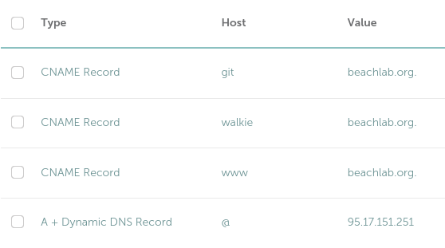

# Nginx web server

<!-- vim-markdown-toc GFM -->

* [Install nginx and create firewall rules](#install-nginx-and-create-firewall-rules)
* [Create and configure your websites](#create-and-configure-your-websites)
* [Point your domain to your machine](#point-your-domain-to-your-machine)
* [Get free trusted SSL certificates for your websites](#get-free-trusted-ssl-certificates-for-your-websites)
* [The result](#the-result)

<!-- vim-markdown-toc -->

## Install nginx and create firewall rules

```bash
sudo apt install nginx
sudo ufw allow 'Nginx Full'
```

## Create and configure your websites

Create your website(s) `sudo mkdir -p /var/www/yourdomain.com` and edit `sudo nano /etc/nginx/sites-available/yourdomain.com` with this content

```bash
server {
listen 80;
listen [::]:80;
root /var/www/mydomain.com;
index index.html;
server_name mydomain.com www.mydomain.com;
location / {
try_files $uri $uri/ =404;
}
}
```

Check for mistakes in the syntax `sudo nginx -t`

Create a link to enable the site: `sudo ln -s /etc/nginx/sites-available/mydomain.com /etc/nginx/sites-enabled/mydomain.com`

Finally reload nginx `sudo systemctl reload nginx`

## Point your domain to your machine

For that you will need to create an A record for `@` (the domain) which points to your public IP and CNAMES for `www` and other hosts pointing to your your domain. If your ISP provides you with a fixed public IP that's all you need to do.

I **don't** have a fixed public IP address though. So instead of an A record  I have [a dynamic A record in namecheap](https://www.namecheap.com/support/knowledgebase/article.aspx/36/11/how-do-i-start-using-dynamic-dns) (where my domains are registered).



Then I use a daemon `ddclient` that uses namecheap API (it can also query several others registrars) to update the IP address in namecheap dynamic A records. Unlike changing an A record, **the dynamic A record propagates instantly**. Install `sudo apt-get install ddclient` and configure ~~`Sudo nano /etc/ddclient/ddclient.conf`~~ `sudo nano /etc/ddclient.conf`

```bash
#### Global Settings
# How often to update (seconds)
daemon=300
ssl=yes
use=web
web=dynamicdns.park-your-domain.com/getip
protocol=namecheap
server=dynamicdns.park-your-domain.com

#### beachlab.org
login=beachlab.org
password='PUT-YOUR-DOMAIN-KEY-HERE'
@.beachlab.org
```

Finally make `ddclient` start when you boot up your ubuntu system

```bash
sudo update-rc.d ddclient defaults
sudo update-rc.d ddclient enable
```

> Is this true?
>
> If the server is in your local network, and you want to reach it by it's hostname, you must point the server local IP address to the server hostname. Get your server machine name `cat /etc/hostname` which in my case returns `thebeachlab` and point it to the **local network** fixed ip address that you set at the beginning `sudo nano /etc/hosts`.
>
> `192.168.1.50 thebeachlab`
>
> Warning: Still not sure why but 127.0.0.1 will not work. You have to use the network ip.

## Get free trusted SSL certificates for your websites

The following step is to create free trusted SSL certificates. This thing used to cost quite a lot of money but now it's pretty straight forward and there's no reason to have an unencrypted connection anymore. Install certbot:

`sudo apt install certbot python3-certbot-nginx`

Make sure that the auto renewal timer is running `sudo systemctl status certbot.timer` otherwise start and enable it `sudo systemctl enable --now certbot.timer`.

To get certificates for your websites

`sudo certbot --nginx -d mydomain.com -d www.mydomain.com`

To obtain a standalone certificate

`sudo certbot certonly --nginx -d whatever.mydomain.com`

Other tasks you can do:

- View your certificates `sudo certbot certificates`
- Test the auto renewal process `sudo certbot renew --dry-run`
- Delete a certificate `sudo certbot delete`

## The result

My proud website hosted in my suitcase:


